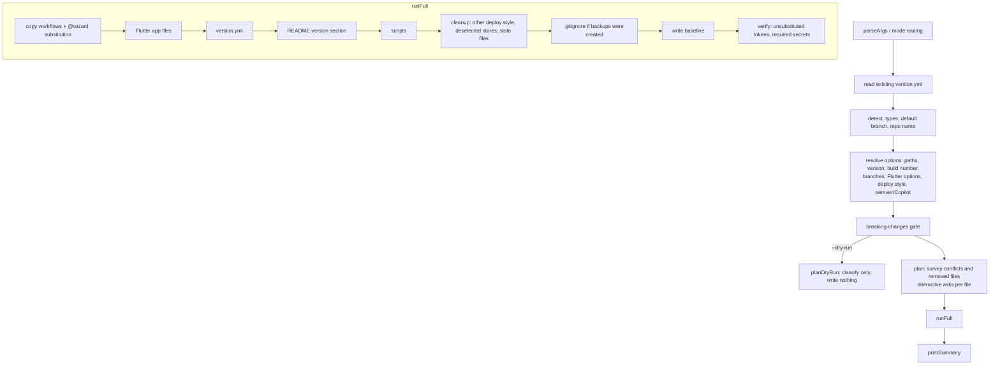

# Architecture

This document explains how `project-auto-wizard` is put together: where the code lives, what
happens during an install, and the rules that keep re-runs safe. For the step-by-step procedure
to add a new project type, see [ADDING-A-PROJECT-TYPE.md](ADDING-A-PROJECT-TYPE.md).

## Module map

```
bin/project-auto-wizard.js   entry point — calls run() from src/index.js
src/
  index.js                   argv → mode routing; non-interactive install pipeline (runInner)
  context.js                 install context object + VALID_TYPES
  cli/                       argument parsing (args.js, CliError) and --help text
  commands/                  one module per mode
    interactive.js           interactive wizard (default when run with no args on a TTY)
    full.js                  runFull — the install executor shared by both entry paths
    dry-run.js status.js doctor.js uninstall.js purge.js
  core/                      pure-ish logic, no prompts (I/O is injected)
    types.js                 project type registry (see "Project types" below)
    detect.js / detect-fs.js type, version, build number, branch, repo name detection; @wizard resolvers
    paths-resolve.js         per-type project paths (monorepo)
    branches.js              main/develop branch config (pr-flow vs trunk-based)
    wizard-env.js            @wizard marker engine (line based, no YAML re-serialization)
    wizard-labels.js         payload/config/wizard-prompts.yml parser (question labels)
    copy/                    installers: workflows.js, simple.js (scripts), readme.js,
                             gitignore.js, flutter-app.js
    baseline.js              .github/.wizard/baseline.json — 3-way update base
    deploy-style.js          server deploy style filter (simple / nginx / traefik / none)
    flutter-options.js       Flutter env mode, store targets, store deploy modes
    removal-plan.js          what counts as "installed by the wizard" (uninstall, purge, stale cleanup)
    version-yml.js           version.yml render/parse
    verify.js                post-install checks (unsubstituted tokens, required secrets)
    logger.js                install log under .github/.wizard/logs/
  ui/                        terminal rendering: prompts, readline engine, banner, summary, env-plan
payload/                     everything that gets installed into a user repo (single source of truth)
  workflows/common/          installed for every type
  workflows/<type>/          installed only for that type (+ optional server-deploy/ subfolder)
  scripts/*.py               release-time scripts → .github/scripts/
  config/                    wizard-prompts.yml (question text), breaking-changes.json
  flutter-app/               fastlane / ExportOptions files for Flutter store deploys
  version.yml.template       rendered into the user's version.yml
scripts/                     repo tooling (sync-dogfood.mjs, run-py-tests.mjs) — not shipped
tests/node, tests/py         test suites (see "Tests")
```

Dependency direction is `commands → core`, `commands → ui`, and `ui → core`. `core` never
imports `ui`; prompts are passed in as `io` so the same logic runs in tests. (One known exception:
`core/paths-resolve.js` imports path helpers and `CliError` from `cli/args.js`.)

The CLI itself is Node (zero runtime dependencies). Everything that runs later inside the
user's GitHub Actions is Python stdlib, so the installed side has no bash/PowerShell split.

## Install pipeline

Both entry paths (`index.js#runInner` for `--mode full --force`, `commands/interactive.js` for
the wizard) resolve the same inputs and then hand a context to `commands/full.js#runFull`.



All of `payload/workflows/common/` is installed, except that branch mode `trunk-based` skips
`VERSION-CONTROL` and `AUTO-CHANGELOG-CONTROL` (RELEASE-PUBLISH does the whole release there).
Then each selected type gets `payload/workflows/<type>/` and `<type>/server-deploy/`, filtered by
deploy style and, for Flutter, by store targets.

Resolution precedence is the same everywhere: **CLI flag → value saved in `version.yml` →
detected value → default**. Saved answers are reused so a re-run does not ask again or silently
revert a choice.

Before writing anything `runFull` checks that every target path is writable, so a failure never
leaves a half-installed repo.

## `@wizard` markers

Workflow templates declare their own questions and computed values with trailing comments. The
engine (`core/wizard-env.js`) works line by line and never parses or re-serializes YAML — that is
what makes the byte-exact "unchanged" comparison possible.

| Form | Example | Effect |
|---|---|---|
| `ask:<default>` | `DEPLOY_PORT: "__DEPLOY_PORT__"  # @wizard ask:8000` | Asked in the env plan step. The literal after `ask:` is the default. The quoted value is replaced and the marker comment is removed. |
| `ask:@<resolver>` | `PROJECT_NAME: "__PROJECT_NAME__"  # @wizard ask:@repo` | Same, but the default comes from a resolver (`repo`, `jdk`, ...). |
| `auto:<resolver>` | `PROJECT_PATH: "."  # @wizard auto:project-path` | Never asked; value is computed by a resolver. |
| `fallback:<resolver>` | `DEPLOY_MODE: ${{ github.event.inputs.deploy_mode \|\| vars.ANDROID_DEPLOY_MODE \|\| 'store_only' }}  # @wizard fallback:android-deploy-mode` | Replaces only the last single-quoted literal of a GitHub expression, so runtime inputs still win. |
| `paths-anchor` | `    # @wizard paths-anchor` | For a monorepo path other than `.`, the whole comment line becomes `paths: ['<path>/**']`. |

Rules:

- Only `KEY: "value"` / `KEY: 'value'` lines are rewritten; the result is always double-quoted.
- An empty resolved value leaves the line untouched (the template default stays).
- `__PROJECT_NAME__` / `__APP_ARTIFACT_NAME__` anywhere in the file are replaced with the repo name.
- Branch placeholders `{{MAIN_BRANCH}}` / `{{DEVELOP_BRANCH}}` are substituted before markers (`core/branding.js`).
- Resolvers are built in `core/detect-fs.js#makeResolvers`. A new `auto:` token needs a resolver there.
- `ask` answers are stored in the `deploy` block of `version.yml` per type and become the default on the next run.
- Question text lives in `payload/config/wizard-prompts.yml` (`KEY`, or `<type>.KEY` for a type-specific override). A user repo can override keys in `.github/config/wizard-prompts.yml`.

## Baseline 3-way update

`.github/.wizard/baseline.json` stores two hashes per installed workflow:

- `installed` — hash of what the wizard actually wrote (only set when the wizard wrote the file)
- `rendered` — hash of the payload template rendered with the saved values at that time

On re-run each workflow is classified (`core/copy/workflows.js#classify`), where *ours* is the
file on disk and *theirs* is the current payload rendered with the saved/answered values:

| Condition | Bucket | Action |
|---|---|---|
| not on disk, not in baseline | `newFiles` | write |
| ours === theirs | `unchanged` | skip |
| sha(ours) === base.installed | `upstreamOnly` | user did not edit → replace silently |
| sha(theirs) === base.rendered | `localOnly` | template did not change → keep user edit silently |
| not on disk, in baseline | `removed` | user deleted it → keep deleted unless they choose to restore |
| anything else | `changed` | real conflict → ask: keep / back up to `.bak` and replace / write `.template.yaml` beside it. Non-interactive default is keep. |

Without a baseline (old installs) only `unchanged` / `changed` are possible; that run writes the
baseline. A kept conflict keeps its old `rendered` hash so the upstream change is offered again
next time.

The same "untouched → delete, edited → `.bak`" rule is used when cleaning up workflows of a
previous deploy style, deselected Flutter stores, and payload files that were renamed or removed
(`core/removal-plan.js#findStaleWorkflows`). Every payload workflow starts with
`# project-auto-wizard:managed-workflow` so renamed files can still be recognized.

## Deploy style filtering

Server deploy workflows are alternatives, so exactly one is installed (`core/deploy-style.js`).
The style is identified by filename suffix:

| Style | Suffix |
|---|---|
| `simple` (default) | `-SIMPLE-CICD.yaml` |
| `nginx` | `-NONSTOP-NGINX-CICD.yaml` |
| `traefik` | `-NONSTOP-TRAEFIK-CICD.yaml` |
| `none` | no server deploy workflow at all (CD, single CD, PR preview) |

- The filter is applied to both `payload/workflows/<type>/` and `<type>/server-deploy/`.
- If a type has no workflow for the chosen style, its `-SIMPLE-CICD.yaml` is installed instead.
- Types with a single CD and no variants (react, next) declare it as `singleServerCd` in the type registry.
- Non-simple templates ship with the push trigger commented out; the chosen one is activated at install time.
- The deploy style question is only asked when a selected type has server deploy workflows.

## Dogfooding sync

This repo installs its own common workflows. `payload/` is the source of truth; never edit the
copies directly.

| Source | Copy in this repo |
|---|---|
| `payload/workflows/common/PROJECT-COMMON-*.yaml` | `.github/workflows/` |
| `payload/scripts/*.py` (those used here) | `.github/scripts/` |

After changing a source, run `npm run sync:dogfood`. Intended differences (ISSUE-HELPER defaults,
the NPM publish trigger in RELEASE-PUBLISH) are declared as `PATCHES` in
`scripts/sync-dogfood.mjs`. `npm run sync:dogfood:check` and `tests/node/dogfood-parity.test.js`
fail when the copies drift.

## Tests

```bash
npm test          # both suites
npm run test:node # node --test, tests/node/*.test.js
npm run test:py   # python unittest, tests/py (launcher: scripts/run-py-tests.mjs)
```

- `tests/node/` — unit tests per module, CLI/mode tests that run `run()` against temp dirs,
  payload contract tests (YAML validity, action versions, `@wizard` usage), and
  `e2e-matrix.test.js`, which installs every type from `tests/fixtures/e2e/<case>/` and checks the
  expected files and that no placeholder is left.
- `tests/node/type-registry-consistency.test.js` fails when a type is missing from any list that
  must mention every type (help, version.yml template, README, `version_manager.py`, payload folders).
- `tests/py/` — the release-time scripts (`version_manager.py`, `changelog_manager.py`, ...).
- `tests/fixtures/` — sample projects used by detection and install tests.

Setting `PYTHONDONTWRITEBYTECODE=1` avoids leaving `__pycache__` in `payload/scripts`.
