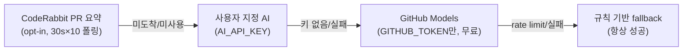
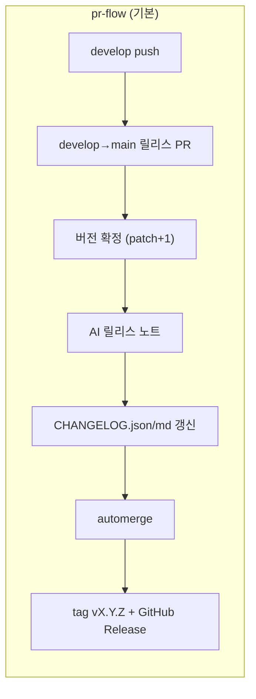
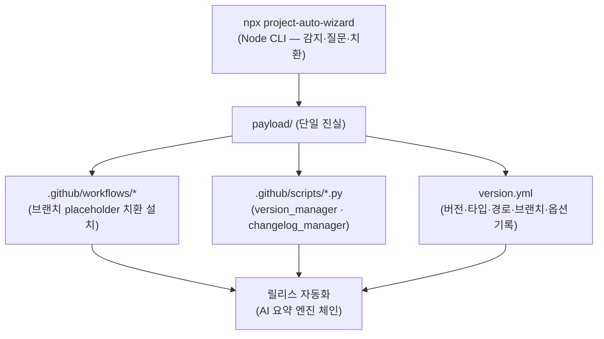

# project-auto-wizard

> **One command DevOps** — `npx` 한 줄로 어떤 프로젝트든 GitHub-native AI 릴리스 자동화를 설치하는 마법사

```bash
npx project-auto-wizard
```

<!-- TODO: 30초 데모 GIF (docs/assets/demo.gif) -->
<!-- TODO: 3분 데모 YouTube 링크 -->

[](https://www.npmjs.com/package/project-auto-wizard)
[](LICENSE)
[](package.json)

<!-- AUTO-VERSION-SECTION: DO NOT EDIT MANUALLY -->
## 최신 버전 : v0.1.1 (2026-07-09)

[전체 버전 기록 보기](CHANGELOG.md)

---

## 왜 만들었나

새 프로젝트를 시작할 때마다 반복되는 일: CI/CD 파이프라인, 버전 관리, 체인지로그, 릴리스 자동화 셋업에 **반나절**.
project-auto-wizard는 이걸 **한 줄, 3분**으로 줄입니다.

```bash
npx project-auto-wizard          # 대화형 마법사
npx project-auto-wizard --mode full --force --type spring,react   # CI에서 비대화형
```

## 무엇을 설치하나 — 3축

| 축 | 내용 |
|---|---|
| ① **npx 마법사** | 마커 파일로 프로젝트 타입 자동 감지 — **9타입 + 멀티타입 + 모노레포 경로**까지. 질문은 최소한만 |
| ② **GitHub-native AI Release Automation** | 릴리스 PR을 열면: 버전 확정 → **AI가 릴리스 노트 작성** → CHANGELOG 갱신 → automerge → tag + GitHub Release. **API 키 0개** (GitHub Models) |
| ③ **타입별 CI/CD 워크플로우** | Spring(무중단 배포 포함)·Flutter(스토어 배포)·React·Next·Python 등 타입에 맞는 GitHub Actions 자동 배치 |

### 지원 프로젝트 타입

`spring` `flutter` `react` `next` `node` `python` `react-native` `react-native-expo` `basic`

- **멀티타입**: `--type spring,react,python` — 한 레포에 여러 타입 공존
- **모노레포**: `--paths "flutter=app,react=client"` — 타입별 서브폴더 지정 (마커 파일 자동 감지)

## API 키 0개 AI — 요약 엔진 체인

릴리스 노트는 4단 엔진 체인으로 생성됩니다. **어떤 단계가 실패해도 릴리스는 절대 막히지 않습니다.**



- 기본값은 **GitHub Models** — Actions의 `GITHUB_TOKEN` + `permissions: models: read`만으로 동작. **비용 0, 설정 0.**
- `AI_API_KEY`/`AI_API_BASE_URL`/`AI_MODEL` secret으로 OpenAI-호환 엔드포인트(Groq, Gemini 호환 모드, Ollama 등) 교체 가능.
- 규칙 fallback 3단: 프로젝트 컨벤션 → Conventional Commits → 무형식 bullet. 커밋 컨벤션이 없어도 동작.

## 릴리스 흐름



- **pr-flow** (기본): `VERSION-CONTROL`(main 직접 push 안전망) + `AUTO-CHANGELOG-CONTROL`(릴리스 PR) + `RELEASE-PUBLISH`(tag+Release) 3종 설치
- **trunk-based** (릴리스 브랜치 = 개발 브랜치): `RELEASE-PUBLISH` 하나가 main push마다 버전확정 → 체인지로그 → tag → Release를 순차 처리
- 마법사가 브랜치를 묻고(`--main-branch`/`--develop-branch`) 없으면 **생성 + push**까지. 선택은 `version.yml`에 저장되어 업데이트 시 재질문 없음

## 설치 옵션

```
npx project-auto-wizard [옵션]

  -m, --mode MODE          full | version | workflows  (기본: 대화형)
  -t, --type CSV           spring,react,... (미지정 시 자동 감지)
      --project-version V  초기 버전 (미지정 시 자동 감지)
      --paths "t=p,..."    모노레포 타입별 경로
      --main-branch B      릴리스 브랜치 (기본: 감지된 default branch)
      --develop-branch B   개발 브랜치 (기본: develop)
      --nexus              Nexus 라이브러리 publish 워크플로우 포함
      --secret-backup      Secret 서버 백업 워크플로우 포함
      --coderabbit         CodeRabbit PR 요약을 릴리스 노트 1순위로
      --force              전 질문 생략 (CI용)
```

## 설치 후 확인할 것

| 항목 | 내용 |
|---|---|
| **`WORKFLOW_PAT` secret** (권장) | automerge 후 후속 워크플로우(tag/Release)가 이어지려면 PAT가 필요합니다 — `GITHUB_TOKEN`으로 머지하면 GitHub 정책상 후속 워크플로우가 트리거되지 않습니다. Settings → Secrets → Actions에 `WORKFLOW_PAT` (scopes: `repo`, `workflow`) 등록. 없으면 `GITHUB_TOKEN`으로 동작하되 Release 발행은 수동 재실행이 필요할 수 있습니다 |
| **Workflow permissions** | Settings → Actions → Workflow permissions: **Read and write** |
| **GitHub Models** | 기본 활성 — 별도 설정 불필요. 조직 정책으로 차단된 경우 자동으로 규칙 fallback |

## 설계 원칙

- **payload 단일 진실**: 마법사가 설치하는 모든 자산은 npm 패키지 동봉 `payload/` 하나에서 나옵니다. 템플릿 레포 clone 없음, 네트워크 접근 0, 설치 재현성 100%
- **크로스플랫폼 무결점**: 마법사는 Node, 설치되는 스크립트는 전부 Python. bash/PowerShell 이중 유지·macOS bash 3.2 함정을 **설계로 제거**
- **graceful degradation**: AI 실패 → 다음 엔진 → 규칙 fallback. 릴리스가 도구 때문에 막히는 일은 없습니다
- **표준 존중**: GitHub 기본 라벨·Releases·Conventional Commits — 커스텀 발명 대신 생태계 표준 위에 구축
- **멱등성**: 같은 명령을 다시 실행해도 안전 — unchanged 파일은 건너뛰고, 충돌은 3지선(유지/백업 후 교체/참고본 추가)으로 처리

## 아키텍처



## 개발

```bash
npm test          # node --test + python unittest (py 51 + node 59)
npm run test:node
npm run test:py
```

이 레포 자체가 project-auto-wizard로 관리됩니다 (도그푸딩) — `.github/workflows/PROJECT-COMMON-*`는 마법사가 설치한 산출물입니다.

## License

[MIT](LICENSE)
