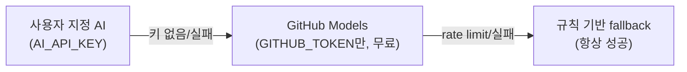
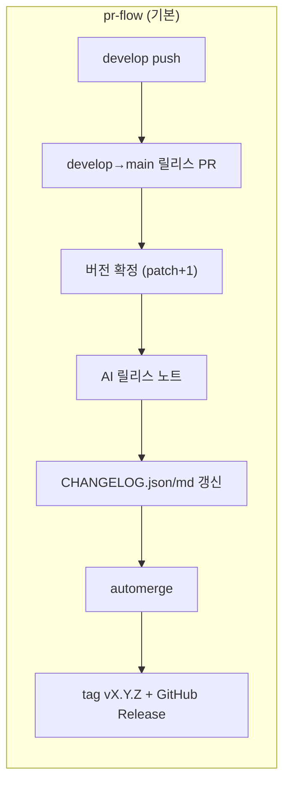
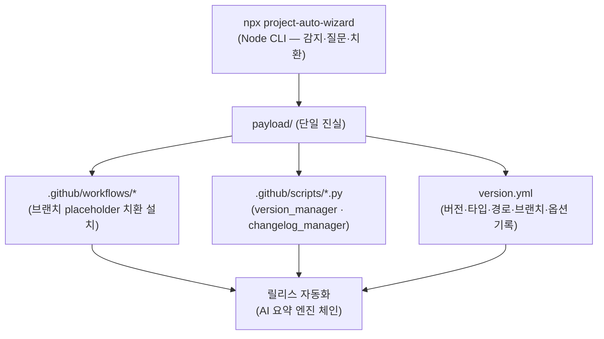

# project-auto-wizard

> **One command DevOps** — `npx` 한 줄로 어떤 프로젝트든 GitHub-native AI 릴리스 자동화를 설치하는 마법사

- 새 프로젝트를 시작하면 코드를 작성하기 전부터 버전 관리, 배포 자동화, 변경 기록 작성처럼 먼저 정해야 할 일이 많다. project-auto-wizard는 이 준비 과정을 명령 한 번으로 구성하고, 프로젝트 상태 관리가 GitHub 안에서 자동으로 동작하도록 해 개발자가 기능 구현에 집중하도록 돕는 오픈소스 도구

```bash
npx project-auto-wizard
```

<!-- TODO: 30초 데모 GIF (docs/assets/demo.gif) -->
<!-- TODO: 3분 데모 YouTube 링크 -->

[](https://github.com/Twin-Fang/project-auto-wizard/actions/workflows/CI.yaml)
[](https://www.npmjs.com/package/project-auto-wizard)
[](LICENSE)
[](package.json)

<!-- AUTO-VERSION-SECTION: DO NOT EDIT MANUALLY -->
## 최신 버전 : v0.1.32 (2026-08-10)

[전체 버전 기록 보기](CHANGELOG.md)

---

## 왜 만들었나

새 프로젝트를 시작할 때마다 반복되는 일: CI/CD 파이프라인, 버전 관리, 체인지로그, 릴리스 자동화 셋업에 **반나절**.
project-auto-wizard는 이걸 **한 줄, 3분**으로 줄입니다.

```bash
npx project-auto-wizard          # 대화형 마법사
npx project-auto-wizard --mode full --force --type spring,react   # CI에서 비대화형
```

## 무엇을 설치하나 — 3축

| 축 | 내용 |
|---|---|
| ① **npx 마법사** | 마커 파일로 프로젝트 타입 자동 감지 — **9타입 + 멀티타입 + 모노레포 경로**까지. 질문은 최소한만 |
| ② **GitHub-native AI Release Automation** | 릴리스 PR을 열면: 버전 확정 → **AI가 릴리스 노트 작성** → CHANGELOG 갱신 → automerge → tag + GitHub Release. **API 키 0개** (GitHub Models) |
| ③ **타입별 CI/CD 워크플로우** | Spring(무중단 배포 포함)·Flutter(스토어 배포)·React·Next·Python 등 타입에 맞는 GitHub Actions 자동 배치 |

### 지원 프로젝트 타입

`spring` `flutter` `react` `next` `node` `python` `react-native` `react-native-expo` `basic`

- **멀티타입**: `--type spring,react,python` — 한 레포에 여러 타입 공존
- **모노레포**: `--paths "flutter=app,react=client"` — 타입별 서브폴더 지정 (마커 파일 자동 감지)
- `spring`/`flutter`/`react`/`next`/`python` 5개 타입은 아래 "타입별 워크플로우 구성"처럼 전용 CI/CD가 설치됩니다. `node`/`react-native`/`react-native-expo`/`basic`은 타입 전용 CI 없이 릴리스 자동화(버전 관리·체인지로그·AI 요약)를 담당하는 공통 워크플로우만 설치됩니다 — 빌드/배포 CI는 직접 추가해서 확장할 수 있습니다.

### 질문 문구 커스터마이징

마법사가 묻는 질문의 라벨·도움말·예시 문구는 `.github/config/wizard-prompts.yml`을 만들어 재정의할 수 있습니다(설치되지 않는 파일이라 직접 만들어야 합니다). 타입별로 다른 문구를 쓰고 싶으면 `{type}.KEY` 형태로 오버라이드합니다.

```yaml
PROJECT_NAME:
  label: "프로젝트 이름이 뭔가요?"
  help: "GitHub 레포 이름과 다르게 표시하고 싶을 때만 입력하세요."

flutter.APP_ARTIFACT_NAME:
  label: "Flutter 앱 아티팩트 이름"
```

### 타입별 워크플로우 구성

`spring`/`flutter`는 아래처럼 단일 CI 이상으로 깊게 구성되어 있습니다:

- **flutter**: Android(Firebase/Playstore/Selfhosted/TestAPK 배포), iOS(TestFlight/Test-TestFlight), CI, Lab 트리거까지 8종
- **spring**: 단일 서버 배포(SIMPLE-CICD, **기본 활성**) + 무중단 배포 2종(Nginx/Traefik, opt-in) + PR 프리뷰 + GitHub Packages publish(항상 설치) + Nexus publish(`--nexus` opt-in)
  - 무중단 배포 워크플로우는 파일은 설치되지만 `push` 트리거가 기본적으로 비활성(`workflow_dispatch`만 활성)입니다. 기본 배포는 SIMPLE-CICD가 담당하며, 무중단 배포로 전환하려면 해당 워크플로우 YAML의 `push.branches` 주석을 해제하고 SIMPLE-CICD의 `push` 트리거는 주석 처리해야 합니다(각 YAML 상단 주석에 안내되어 있습니다).
- **react/next**: CI와 CI+CD 분리 구성
- **python**: CI / PR 프리뷰 / SimpleCICD

### 되돌리기(`--mode revert`)

`npx project-auto-wizard --mode revert --force`는 payload가 설치한 파일명과 **정확히 일치하는 것만** 제거합니다. 사용자가 직접 만든 워크플로우, `version.yml`, `README.md`, `.gitignore`는 건드리지 않습니다. 설치 시 충돌 처리로 생성된 `.bak`/`.template.yaml` 파생 파일도 함께 정리됩니다.

### 완전 삭제(`--mode uninstall`)

`npx project-auto-wizard --mode uninstall`은 `revert`보다 넓게 제거합니다 — 워크플로우·스크립트는 물론, README.md의 `AUTO-VERSION-SECTION` 버전 섹션과 `.gitignore`에 자동 추가된 항목, `version.yml`까지 선택적으로 제거할 수 있습니다.

- **대화형(TTY)**: 실제로 설치된 항목만 체크리스트로 보여줍니다. 워크플로우·스크립트는 기본 체크, README·`.gitignore`·`version.yml`은 opt-in입니다. 선택 후 최종 확인(기본 "아니오")을 거쳐야 실제로 삭제됩니다.
- **비대화형(`--force`)**: 워크플로우·스크립트만 기본 삭제합니다. README·`.gitignore`·`version.yml`까지 지우려면 `--purge-readme`/`--purge-gitignore`/`--purge-version`을 함께 지정하세요.
- `--dry-run`과 함께 쓰면 무엇이 지워질지 미리 볼 수 있습니다.

```bash
npx project-auto-wizard --mode uninstall                 # 대화형 체크리스트
npx project-auto-wizard --mode uninstall --force         # 워크플로우·스크립트만 안전 삭제
npx project-auto-wizard --mode uninstall --force --purge-readme --purge-gitignore --purge-version  # 완전 삭제
```

## API 키 0개 AI — 요약 엔진 체인

릴리스 노트는 3단 엔진 체인으로 생성됩니다. **상용 서드파티 서비스에 전혀 의존하지 않으며, 어떤 단계가 실패해도 릴리스는 절대 막히지 않습니다.**


```mermaid
flowchart LR
    B["사용자 지정 AI<br/>(AI_API_KEY)"] -->|"키 없음/실패"| C["GitHub Models<br/>(GITHUB_TOKEN만, 무료)"]
    C -->|"rate limit/실패"| D["규칙 기반 fallback<br/>(항상 성공)"]
```

- 기본값은 **GitHub Models** — Actions의 `GITHUB_TOKEN` + `permissions: models: read`만으로 동작. **비용 0, 설정 0.**
- `AI_API_KEY`/`AI_API_BASE_URL`/`AI_MODEL` secret으로 OpenAI-호환 엔드포인트(Groq, Gemini 호환 모드, Ollama 등) 교체 가능.
- 규칙 fallback 3단: 프로젝트 컨벤션 → Conventional Commits → 무형식 bullet. 커밋 컨벤션이 없어도 동작.

## 릴리스 흐름


```mermaid
flowchart LR
    subgraph pr-flow ["pr-flow (기본)"]
        D1[develop push] --> PR[develop→main 릴리스 PR]
        PR --> V["버전 확정 (patch+1)"]
        V --> AI[AI 릴리스 노트]
        AI --> CL[CHANGELOG.json/md 갱신]
        CL --> AM[automerge]
        AM --> TAG["tag vX.Y.Z + GitHub Release"]
    end
```

릴리스 PR이 머지되면 `RELEASE-PUBLISH`가 태그와 GitHub Release를 발행합니다. 이 저장소 자신은 그 **Release 발행 이벤트**를 받아 npm에 배포합니다 — 태그가 불변 스냅샷이므로 "무엇이 배포되는가"가 워크플로우 실행 타이밍에 좌우되지 않고, 배포처를 늘릴 때도 같은 이벤트에 워크플로우를 하나 더 붙이면 됩니다.

- **pr-flow** (기본): `VERSION-CONTROL`(main 직접 push 안전망) + `AUTO-CHANGELOG-CONTROL`(릴리스 PR) + `RELEASE-PUBLISH`(tag+Release) 3종 설치
- **trunk-based** (릴리스 브랜치 = 개발 브랜치): `RELEASE-PUBLISH` 하나가 main push마다 버전확정 → 체인지로그 → tag → Release를 순차 처리
- 마법사가 브랜치를 묻고(`--main-branch`/`--develop-branch`) 없으면 **생성 + push**까지. 선택은 `version.yml`에 저장되어 업데이트 시 재질문 없음

## 설치 옵션

```
npx project-auto-wizard [옵션]

  -m, --mode MODE          full | version | workflows | revert | uninstall | status | doctor  (기본: 대화형)
  -t, --type CSV           spring,react,... (미지정 시 자동 감지)
      --project-version V  초기 버전 (미지정 시 자동 감지)
      --paths "t=p,..."    모노레포 타입별 경로
      --main-branch B      릴리스 브랜치 (기본: 감지된 default branch)
      --develop-branch B   개발 브랜치 (기본: develop)
      --nexus              Nexus 라이브러리 publish 워크플로우 포함
      --secret-backup      Secret 서버 백업 워크플로우 포함
      --semver-auto        커밋 타입 기반 자동 major/minor/patch 승격 (기본: 사용함, --no-semver-auto로 끔)
      --dry-run            실제 파일 변경 없이 무엇이 바뀔지만 미리 보여줌
      --purge-readme        --mode uninstall --force 시 README.md 버전 섹션도 제거
      --purge-gitignore     --mode uninstall --force 시 .gitignore 자동 추가 항목도 제거
      --purge-version       --mode uninstall --force 시 version.yml도 제거
      --force              full/version/workflows/revert 실행에 필수 (전 질문 생략, CI용)
```

## 설치 상태 확인 · 진단 · 미리보기

```bash
npx project-auto-wizard --mode status   # 설치 상태·드리프트 확인 (읽기 전용)
npx project-auto-wizard --mode doctor   # 환경 진단 (읽기 전용, 규칙 기반)
```

| 명령 | 내용 |
|---|---|
| `--mode status` | 설치된 버전·타입·브랜치 모드·옵션값과, 설치 시점 대비 사용자가 직접 수정한 워크플로우 파일 목록을 보여줍니다. 네트워크 접근 없음(로컬 파일 비교만) |
| `--mode doctor` | `version.yml` 설치 여부, `gh` CLI 설치/인증 상태, GitHub Actions workflow permissions, `WORKFLOW_PAT` secret 등록 여부, merge commit 허용 설정을 점검합니다. `gh api` 호출을 사용하므로 네트워크 접근이 발생합니다(규칙 기반 점검 — AI 진단 아님) |

`doctor`는 항목마다 **그 설정이 무엇을 담당하는지**를 라벨에 함께 표시하고, 문제가 있는 항목만 `현상 → 그대로 두면 무엇이 안 되는지 → 어디를 눌러 고치는지 → 문서 링크` 순으로 펼쳐 보여줍니다. 정상 항목은 한 줄로 압축됩니다. GitHub 설정 화면에 실제로 표시되는 문자열(`Read and write permissions` 등)은 화면에서 찾을 수 있도록 원문 그대로 출력합니다.

```
◆  환경 진단 — project-auto-wizard doctor

  [✓] gh CLI — 레포 설정 조회용                    gh version 2.96.0
  [✓] GitHub 로그인 — 레포 설정 조회 권한          인증됨
  [✓] merge commit 허용 — 릴리스 PR 자동 머지 조건  허용됨

  [!] WORKFLOW_PAT — 자동 태그·Release 발행
      ✗ secret이 등록되어 있지 않습니다.
        PR 자동 머지 뒤 태그·Release 워크플로가 이어지지 않습니다.
        (GitHub 정책상 기본 토큰으로 만든 커밋은 다음 워크플로를 깨우지 못합니다)
      → 개인 액세스 토큰 발급 (scopes: repo, workflow)
      → 레포 Settings → Secrets and variables → Actions
      → New repository secret · 이름은 WORKFLOW_PAT
      → 자세히: https://github.com/Twin-Fang/project-auto-wizard#post-install

  [i] Workflow permissions — 직접 추가한 워크플로우의 기본 권한
      현재 read 입니다 — 마법사가 설치한 워크플로우는 각자 권한을 선언하므로 그대로 동작합니다.
  [i] GitHub Models — AI 릴리스 노트 생성
      조직 정책으로 차단됐는지는 자동으로 확인할 수 없습니다 (Settings → Models).
      차단돼 있어도 규칙 기반 요약으로 자동 전환되므로 그대로 두셔도 됩니다.

  ! 1개 항목에서 문제를 찾았습니다.
    설치 자체는 지금 진행할 수 있고, 위 1개는 나중에 설정해도 됩니다.
```

> **드리프트 판정 기준**: `--mode status`는 설치된 워크플로우 파일이 "설치 시점 기본값 템플릿"과 바이트 단위로 일치하는지만 비교합니다 — 파일을 직접 편집했는지는 추적하지 않습니다. 대화형 설치에서 `@wizard ask` 질문(예: 배포 포트)에 기본값이 아닌 값으로 응답했다면, 파일을 전혀 수정하지 않았더라도 설치 직후부터 항상 "사용자가 수정한 워크플로우 파일"로 표시됩니다. 정상 동작이며, 파일을 직접 편집했는지 구분하려면 해당 값이 예상한 응답과 일치하는지 직접 확인하세요.

`--dry-run`을 어떤 모드와도 함께 쓰면 실제로 파일을 바꾸지 않고 무엇이 바뀔지만 미리 보여줍니다(`full`/`version`/`workflows`/`revert` 전체 지원):

```bash
npx project-auto-wizard --mode full --force --type node --dry-run
```

### 자동 semver 승격 (`--semver-auto`)

기본적으로 켜져 있습니다. 커밋 메시지 컨벤션(`feat:` → minor, `!` 브레이킹 마커 → major, 그 외 → patch)을 기반으로 다음 버전을 자동으로 계산합니다. 분류가 애매한 커밋은 AI 엔진 체인이 patch→minor 승격 여부를 판단합니다. 끄면 기존과 동일하게 항상 patch+1입니다.

```bash
npx project-auto-wizard --semver-auto      # 기본값, 명시 지정도 가능
npx project-auto-wizard --no-semver-auto   # 항상 patch+1 (레거시 동작)
```

### 자체 AI PR 요약봇

상용 PR 리뷰 SaaS 없이 동작하는 자체 요약봇입니다. 릴리스 브랜치(`--main-branch`)를 대상으로 하는 PR이 열릴 때 API 키 0개 AI 엔진 체인으로 요약 코멘트를 자동으로 답니다.

기본 설치(pr-flow) 기준으로 일상적인 기능 PR은 `develop`을 대상으로 열리므로, 이 봇은 develop→main 릴리스 PR에서만 실제로 동작합니다 — 해당 PR에서는 `AUTO-CHANGELOG-CONTROL`이 이미 같은 엔진으로 체인지로그 요약을 생성하므로, 이 봇은 그 요약을 PR 코멘트 형태로도 남겨주는 보조 역할입니다. 릴리스 브랜치 = 개발 브랜치인 trunk-based 모드에서는 모든 PR이 곧 릴리스 대상 브랜치를 향하므로 매 PR마다 동작합니다.

<a id="post-install"></a>

## 설치 후 확인할 것

| 항목 | 내용 |
|---|---|
| **`WORKFLOW_PAT` secret** (권장) | automerge 후 후속 워크플로우(tag/Release)가 이어지려면 PAT가 필요합니다 — `GITHUB_TOKEN`으로 머지하면 GitHub 정책상 후속 워크플로우가 트리거되지 않습니다. Settings → Secrets → Actions에 `WORKFLOW_PAT` (scopes: `repo`, `workflow`) 등록. 없으면 `GITHUB_TOKEN`으로 동작하되 Release 발행은 수동 재실행이 필요할 수 있습니다 |
| **Workflow permissions** | Settings → Actions → Workflow permissions: **Read and write** |
| **GitHub Models** | 기본 활성 — 별도 설정 불필요. 조직 정책으로 차단된 경우 자동으로 규칙 fallback |

## 설계 원칙

- **payload 단일 진실**: 마법사가 설치하는 모든 자산은 npm 패키지 동봉 `payload/` 하나에서 나옵니다. 템플릿 레포 clone 없음, 네트워크 접근 0, 설치 재현성 100%
- **크로스플랫폼 무결점**: 마법사는 Node, 설치되는 스크립트는 전부 Python. bash/PowerShell 이중 유지·macOS bash 3.2 함정을 **설계로 제거**
- **graceful degradation**: AI 실패 → 다음 엔진 → 규칙 fallback. 릴리스가 도구 때문에 막히는 일은 없습니다
- **표준 존중**: GitHub 기본 라벨·Releases·Conventional Commits — 커스텀 발명 대신 생태계 표준 위에 구축
- **멱등성**: 같은 명령을 다시 실행해도 안전 — unchanged 파일은 건너뛰고, 충돌은 3지선(유지/백업 후 교체/참고본 추가)으로 처리

## 아키텍처


```mermaid
flowchart TB
    CLI["npx project-auto-wizard<br/>(Node CLI — 감지·질문·치환)"] --> P["payload/ (단일 진실)"]
    P --> W[".github/workflows/*<br/>(브랜치 placeholder 치환 설치)"]
    P --> S[".github/scripts/*.py<br/>(version_manager · changelog_manager)"]
    P --> V["version.yml<br/>(버전·타입·경로·브랜치·옵션 기록)"]
    W --> R["릴리스 자동화<br/>(AI 요약 엔진 체인)"]
    S --> R
    V --> R
```

## 개발

```bash
npm test          # node --test + python unittest (node 222 + py 87)
npm run test:node
npm run test:py
```

이 레포 자체가 project-auto-wizard로 관리됩니다 (도그푸딩) — `.github/workflows/PROJECT-COMMON-*`는 마법사가 설치한 산출물입니다.

## License

[MIT](LICENSE)
