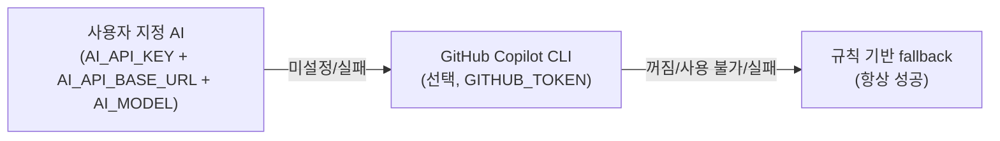
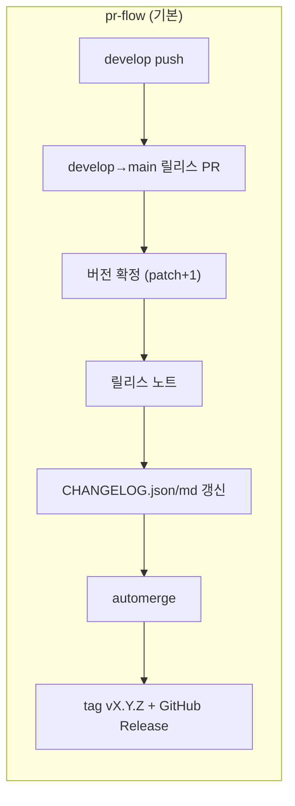
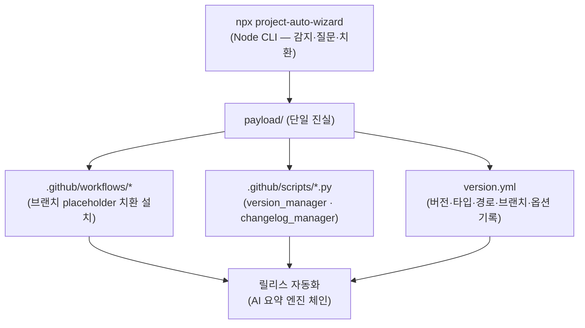

# project-auto-wizard

> **One command DevOps** — `npx` 한 줄로 어떤 프로젝트든 GitHub-native 릴리스 자동화(GitHub Copilot AI 요약은 선택)를 설치하는 마법사

- 새 프로젝트를 시작하면 코드를 작성하기 전부터 버전 관리, 배포 자동화, 변경 기록 작성처럼 먼저 정해야 할 일이 많다. project-auto-wizard는 이 준비 과정을 명령 한 번으로 구성하고, 프로젝트 상태 관리가 GitHub 안에서 자동으로 동작하도록 해 개발자가 기능 구현에 집중하도록 돕는 오픈소스 도구

```bash
npx project-auto-wizard
```

<!-- TODO: 30초 데모 GIF (docs/assets/demo.gif) -->
<!-- TODO: 3분 데모 YouTube 링크 -->

[](https://github.com/Twin-Fang/project-auto-wizard/actions/workflows/CI.yaml)
[](https://www.npmjs.com/package/project-auto-wizard)
[](LICENSE)
[](package.json)

<!-- AUTO-VERSION-SECTION: DO NOT EDIT MANUALLY -->
## 최신 버전 : v0.11.0 (2026-09-23)

[전체 버전 기록 보기](CHANGELOG.md)

---

## 왜 만들었나

새 프로젝트를 시작할 때마다 반복되는 일: CI/CD 파이프라인, 버전 관리, 체인지로그, 릴리스 자동화 셋업에 **반나절**.
project-auto-wizard는 이걸 **한 줄, 3분**으로 줄입니다.

```bash
npx project-auto-wizard          # 대화형 마법사
npx project-auto-wizard --mode full --force --type spring,react   # CI에서 비대화형
```

## 무엇을 설치하나 — 3축

| 축 | 내용 |
|---|---|
| ① **npx 마법사** | 마커 파일로 프로젝트 타입 자동 감지 — **10타입 + 멀티타입 + 모노레포 경로**까지. 질문은 최소한만 |
| ② **GitHub-native Release Automation** | 릴리스 PR을 열면: 버전 확정 → **릴리스 노트 작성**(기본은 규칙 기반, GitHub Copilot AI는 선택) → CHANGELOG 갱신 → automerge → tag + GitHub Release. **API 키 0개** |
| ③ **타입별 CI/CD 워크플로우** | Spring(무중단 배포 포함)·Flutter(스토어 배포)·React·Next·Python·Go 등 타입에 맞는 GitHub Actions 자동 배치 |

### 지원 프로젝트 타입

`spring` `flutter` `react` `next` `node` `python` `react-native` `react-native-expo` `basic` `go`

- **멀티타입**: `--type spring,react,python` — 한 레포에 여러 타입 공존
- **모노레포**: `--paths "flutter=app,react=client"` — 타입별 서브폴더 지정 (마커 파일 자동 감지)
- `spring`/`flutter`/`react`/`next`/`python`/`go` 6개 타입은 아래 "타입별 워크플로우 구성"처럼 전용 CI/CD가 설치됩니다. `node`/`react-native`/`react-native-expo`/`basic`은 타입 전용 CI 없이 릴리스 자동화(버전 관리·체인지로그·AI 요약)를 담당하는 공통 워크플로우만 설치됩니다 — 빌드/배포 CI는 직접 추가해서 확장할 수 있습니다.

### 질문 문구 커스터마이징

마법사가 묻는 질문의 라벨·도움말·예시 문구는 `.github/config/wizard-prompts.yml`을 만들어 재정의할 수 있습니다(설치되지 않는 파일이라 직접 만들어야 합니다). 타입별로 다른 문구를 쓰고 싶으면 `{type}.KEY` 형태로 오버라이드합니다.

```yaml
PROJECT_NAME:
  label: "프로젝트 이름이 뭔가요?"
  help: "GitHub 레포 이름과 다르게 표시하고 싶을 때만 입력하세요."

flutter.APP_ARTIFACT_NAME:
  label: "Flutter 앱 아티팩트 이름"
```

### 타입별 워크플로우 구성

`spring`/`flutter`는 아래처럼 단일 CI 이상으로 깊게 구성되어 있습니다:

- **flutter**: Android(Firebase/Playstore/Selfhosted/TestAPK 배포), iOS(TestFlight/Test-TestFlight), CI, Lab 트리거까지 8종 — 스토어 배포(Play Store·TestFlight)는 고른 플랫폼만 설치되고 fastlane 파일도 함께 생성됩니다. 환경변수 방식·배포 모드 등 자세한 내용은 아래 "Flutter 워크플로우 상세"를 참고하세요.
- **spring**: 서버 배포 1종(단일 서버 / 무중단 Nginx / 무중단 Traefik / 배포 안 함 중 택1) + PR 프리뷰 + 라이브러리 publish 2종(Nexus·GitHub Packages, `--nexus` opt-in)
  - 서버 배포 워크플로우는 **서로 대체재**라 하나만 설치합니다. 대화형에서 고르면 그것만 깔리고 **`push` 트리거까지 켜진 채로** 설치됩니다. 비대화형은 `--deploy-style simple|nginx|traefik|none` (기본: `simple`).
  - 고른 방식은 `version.yml`에 기록되므로 다시 실행해도 묻지 않습니다. 방식을 바꾸면 **이전 워크플로우를 마법사가 정리합니다** — 손대지 않은 파일은 삭제하고, 수정한 파일은 `.bak`으로 옮겨 내용을 보존합니다. 남겨두면 배포가 두 번 돕니다.
  - PR 프리뷰는 배포 방식과 무관한 별개 축이라 선택과 관계없이 함께 설치됩니다 (단, `none`을 고르면 PR 프리뷰도 함께 제외됩니다 — 서버 배포 자체를 하지 않는 프로젝트를 위한 선택지입니다).
- **react/next**: CI와 CI+CD 분리 구성
- **python**: CI / PR 프리뷰 / SimpleCICD
- **go**: CI(Dockerfile 불필요, go test/vet/build/lint) / PR 프리뷰 / SimpleCICD(Dockerfile 있는 프로젝트만 해당)

<a id="flutter-store"></a>

#### Flutter 워크플로우 상세

프로젝트 타입에 `flutter`가 포함되면 마법사가 아래 선택지 3개를 묻습니다. 고른 값은 `version.yml`의 `metadata.template.options`(`env_mode`, `flutter_store`, `android_deploy_mode`, `ios_deploy_mode`)에 기록되므로 다시 실행해도 묻지 않고, 나중에 바꾸려면 확인 화면의 **수정하기 > 환경변수 방식 / 스토어 배포 대상 / 배포 모드**를 쓰세요. Flutter가 없는 프로젝트에는 이 질문·저장값이 전혀 나타나지 않습니다.

| 선택지 | 값 | 기본값 | CLI 플래그 |
|---|---|---|---|
| 환경변수 방식 | `dart-define` / `dotenv` | 신규 설치는 `dart-define`. `version.yml`이 이미 있고 저장값이 없는 설치는 기존 동작을 보존하려고 `dotenv` 유지 | `--flutter-env-mode` |
| 스토어 배포 대상 | Android(Play Store) / iOS(TestFlight) 다중 선택 | 대화형 신규 설치는 아무것도 선택하지 않은 상태, 비대화형·플래그 미지정은 현행 동작(둘 다 설치). 저장값이 없는 기존 설치는 이미 설치된 스토어 워크플로우에서 초기 선택을 추론 | `--flutter-store android,ios,none` |
| 배포 모드 | 고른 플랫폼별 `store_only` / `store_prepare` / `store_submit` | `store_only` | `--android-deploy-mode`, `--ios-deploy-mode` |

**설치되는 구성**

- 항상 설치: `CI`, `ANDROID-FIREBASE-CICD`, `ANDROID-SELFHOSTED-CICD`, `ANDROID-TEST-APK`, `APP-BUILD-TRIGGER`
- Android를 고르면: `ANDROID-PLAYSTORE-CICD` + `android/fastlane/Fastfile.playstore`
- iOS를 고르면: `IOS-TESTFLIGHT` + `IOS-TEST-TESTFLIGHT` + `ios/fastlane/Fastfile` + `ios/ExportOptions.plist`
- fastlane은 위 스토어 배포 워크플로우에서만 씁니다. `SELFHOSTED`와 `TEST-APK`는 `flutter build apk --release`를 직접 실행하며 Ruby·fastlane을 설치하지 않습니다.
- `Fastfile`과 `ExportOptions.plist`는 **Flutter 루트 기준**으로(모노레포는 `--paths flutter=app`이면 `app/` 아래) **없을 때만 생성**합니다. 이미 있으면 덮어쓰지 않고 설치 요약과 `--dry-run`에 "기존 파일 유지"로 표시하며, `--mode uninstall`도 이 파일들은 건드리지 않습니다(사용자 소유 파일).
- 스토어 대상을 해제하고 다시 실행하면 배포 방식을 바꿀 때와 같은 규칙으로 정리합니다 — 손대지 않은 워크플로우는 삭제하고, 수정한 것은 `.bak`으로 옮겨 보존합니다. `Fastfile`·`ExportOptions.plist`는 삭제하지 않습니다.

**환경변수 방식**

두 방식 모두 시크릿 `ENV_FILE`(없으면 `ENV`)에 `.env` 형식으로 값을 넣어 두면 됩니다. 두 방식을 동시에 쓰는 모드는 없습니다.

- `dart-define`: `ENV_FILE`을 프로젝트 밖 임시 경로(러너 임시 폴더)에 쓰고 모든 `flutter build`에 `--dart-define-from-file`로 넘깁니다. 프로젝트 루트에는 `.env`를 만들지 않으며, 코드에서는 `String.fromEnvironment('KEY')`로 읽습니다. 값이 아닌 파일 경로를 넘기므로 `--verbose` 로그에도 값이 명령줄에 노출되지 않습니다.
- `dotenv`: Flutter 루트에 `.env`를 만든 뒤 빌드합니다(`build_runner`가 그 뒤에 실행되는 순서 유지). `flutter_dotenv`·`envied`를 쓰는 프로젝트가 여기에 해당합니다. 이 `.env`에는 아래 파서 제약이 적용되지 않습니다.

`dart-define` 방식에서 `ENV_FILE`은 Flutter의 `--dart-define-from-file` 파서가 읽으므로 다음 범위만 지원됩니다 (근거: Flutter 3.47.5 `flutter_tools/lib/src/runner/flutter_command.dart`의 `DotEnvRegex`).

- 내용이 `{`로 시작하면 JSON 파일로 해석하고, 그렇지 않으면 `KEY=값` 줄로 해석합니다. 키는 `[a-zA-Z_][a-zA-Z0-9_]*` 형태여야 합니다.
- `#`로 시작하는 주석 줄과 빈 줄은 무시합니다.
- 값은 `"…"`, `'…'`, `` `…` `` 따옴표가 벗겨지고 그 뒤의 `# 주석`은 제거됩니다. 따옴표 없는 값은 공백 또는 `#` 앞까지 읽으며, 값 안의 `=`는 허용됩니다.
- `export KEY=값` 형태와 멀티라인(`"""`) 값은 지원하지 않아 빌드가 오류로 종료됩니다.

**배포 모드** — 플랫폼별로 아래처럼 동작합니다(모르는 값은 `store_only`로 취급). 기본값은 워크플로우 표현식의 폴백 자리에 반영되며, 저장소 변수 `ANDROID_DEPLOY_MODE`·`IOS_DEPLOY_MODE`와 `workflow_dispatch` 입력이 항상 우선합니다.

| 모드 | Play Store (Android) | TestFlight / App Store (iOS) |
|---|---|---|
| `store_only` | internal 트랙에 업로드 | TestFlight 업로드 |
| `store_prepare` | production 트랙에 draft 상태로 업로드 (Play Console에서 직접 출시) | 앱 버전·메타데이터 준비까지 (심사 제출 안 함) |
| `store_submit` | production 트랙에 심사 제출 | 심사 제출까지 |

> `store_submit`을 고르면 **main push마다 심사가 자동 제출**됩니다.

**필요한 Secrets · Variables** — 설치 완료 화면과 실행 로그에도 설치된 워크플로우가 실제로 요구하는 Secret 목록이 출력됩니다.

| 대상 | Secrets | Variables |
|---|---|---|
| 모든 Flutter 빌드 | `ENV_FILE` (없으면 `ENV`) | — |
| Android 서명 (`PLAYSTORE`·`FIREBASE`·`TEST-APK`) | `RELEASE_KEYSTORE_BASE64`, `RELEASE_KEYSTORE_PASSWORD`, `RELEASE_KEY_ALIAS`, `RELEASE_KEY_PASSWORD`, `GOOGLE_SERVICES_JSON` | — |
| Play Store (`PLAYSTORE`) | `GOOGLE_PLAY_SERVICE_ACCOUNT_JSON_BASE64`, `ANDROID_PACKAGE_NAME` | `ANDROID_PACKAGE_NAME`(Secret이 없을 때 대신 사용), `ANDROID_DEPLOY_MODE`(선택) |
| iOS (`IOS-TESTFLIGHT`·`IOS-TEST-TESTFLIGHT`) | `APP_STORE_CONNECT_API_KEY_BASE64`, `APP_STORE_CONNECT_API_KEY_ID`, `APP_STORE_CONNECT_ISSUER_ID`, `APPLE_CERTIFICATE_BASE64`, `APPLE_CERTIFICATE_PASSWORD`, `APPLE_PROVISIONING_PROFILE_BASE64`, `IOS_PROVISIONING_PROFILE_NAME`, `IOS_BUNDLE_ID`, `SECRETS_XCCONFIG`(선택) | `IOS_BUNDLE_ID`(Secret이 없을 때 대신 사용), `IOS_DEPLOY_MODE`(선택) |
| Firebase 배포 (`FIREBASE`·`TEST-APK`) | `FIREBASE_SERVICE_ACCOUNT_JSON_BASE64` | — |
| Selfhosted 배포 (`SELFHOSTED`) | `SERVER_HOST`, `SERVER_USER`, `SERVER_PASSWORD`, `DEBUG_KEYSTORE` | — |

`ANDROID_PACKAGE_NAME`은 `PLAYSTORE` 워크플로우가 fastlane에 패키지명으로 넘깁니다(`secrets` 우선, 없으면 `vars`). iOS의 `IOS_BUNDLE_ID`와 같은 플랫폼 접두사 규칙입니다.

**`ExportOptions.plist`에 채워야 할 값** — 마법사가 만든 `ios/ExportOptions.plist`에는 아래 플레이스홀더가 들어 있어 실제 값으로 바꿔야 합니다. 채우지 않고 `IOS-TESTFLIGHT`를 실행하면 `xcodebuild`의 알기 어려운 오류 대신 플레이스홀더가 남았다는 메시지로 검증 단계에서 중단되며, `--mode doctor`도 같은 항목을 WARN으로 알려줍니다.

| 플레이스홀더 | 채울 값 |
|---|---|
| `__TEAM_ID__` | Apple Developer Team ID |
| `__BUNDLE_ID__` | 앱 번들 ID (`IOS_BUNDLE_ID`와 같은 값) |
| `__PROVISIONING_PROFILE_NAME__` | 프로비저닝 프로파일 이름 (`IOS_PROVISIONING_PROFILE_NAME`과 같은 값) |

**모노레포와 `ci-gate`**

- `--paths flutter=app`처럼 Flutter 하위 폴더를 지정하면 모든 Flutter 워크플로우가 그 폴더(`FLUTTER_PROJECT_DIR`)를 기준으로 동작하고, main push로 도는 배포 워크플로우(`PLAYSTORE`·`IOS-TESTFLIGHT`·`SELFHOSTED`·`FIREBASE`)는 `app/**`가 바뀔 때만 실행됩니다(Spring 등 다른 타입과 같은 `paths` 필터).
- CI 워크플로우(Flutter·Go·Next·Python·React·Spring NEXUS-CI)는 `push`·`pull_request`에서 항상 실행되고, 첫 job `changes`가 변경 파일을 판별해 나머지 job을 건너뜁니다(건너뛴 job은 Success). 마지막 job `ci-gate`는 항상 실행되어 필수 job이 모두 success 또는 skipped이면 통과하고 failure·cancelled가 하나라도 있으면 실패합니다.
- 브랜치 보호 규칙의 required status check에는 개별 job이 아니라 **`CI Gate`(`ci-gate`) 하나만** 등록하세요. 경로 필터로 워크플로우 자체를 건너뛰면 required check가 Pending에 머물러 머지가 막히지만, job을 건너뛰는 방식은 그렇지 않기 때문입니다.
- 워크플로우 `paths` 필터는 태그 push에 적용되지 않습니다(GitHub 문서).

**Gemfile** — 스토어 배포 워크플로우(`PLAYSTORE`·`IOS-TESTFLIGHT`·`IOS-TEST-TESTFLIGHT`)는 사용자 `Gemfile`에 `fastlane`이 있으면 그것을 쓰고, 없으면 실행할 때 생성합니다. 마법사는 Gemfile 템플릿을 배포하지 않습니다. fastlane 공식 문서가 권장하는 대로 `Gemfile`(`gem "fastlane"`)과 `Gemfile.lock`을 저장소에 커밋해 두면 버전이 고정되어 재현성이 좋아집니다.

### 실행 로그 (`.github/.wizard/logs/`)

설치·업데이트·삭제를 실행할 때마다 `.github/.wizard/logs/<시각>-<동작>.log`에 실행 추적이 남습니다. 감지 근거, **파일별 처리 결정과 그 사유**, 치환된 값, 미치환 항목, 등록해야 하는 GitHub Secret이 시간순으로 기록되고, 파일 끝에 결과 요약이 붙습니다.

```
07:46:01 INFO  detect    type        spring (근거: build.gradle)
07:46:01 INFO  copy      write       PROJECT-SPRING-SIMPLE-CICD.yaml (new)
07:46:01 INFO  copy      keep-local  PROJECT-COMMON-VERSION-CONTROL.yaml (업스트림 무변경, 사용자 수정본 유지)
07:46:01 WARN  verify    unresolved  PROJECT-SPRING-PR-PREVIEW.yaml:43 __APPLICATION_YML_PATH__
```

업데이트에서 "내가 고친 워크플로우가 유지됐는지 덮였는지"를 이 로그로 확인할 수 있습니다. 한 줄씩 즉시 기록하므로 도중에 중단되어도 직전까지의 흐름이 남습니다. 로그 기록에 실패해도 설치 자체는 정상 완료됩니다.

이 폴더에는 자체 `.gitignore`(`*`, `!.gitignore`)가 함께 생성되어 **로그가 git에 올라가지 않습니다**. 최근 20개만 보관하고 오래된 것부터 정리합니다. `--dry-run`은 파일을 만들지 않는 것이 계약이므로 로그도 남기지 않습니다.

`.github/.wizard/`에는 업데이트 3-way 판정에 쓰는 `baseline.json`도 함께 들어 있어, 완전 삭제 시 워크플로우와 함께 제거됩니다.

### 완전 삭제(`--mode uninstall`)

`npx project-auto-wizard --mode uninstall`은 마법사가 설치한 것을 제거합니다 — 워크플로우·스크립트는 물론, README.md의 `AUTO-VERSION-SECTION` 버전 섹션과 `.gitignore`에 자동 추가된 항목, `version.yml`까지 선택적으로 제거할 수 있습니다.

제거 대상은 payload가 설치한 파일명과 정확히 일치하는 것, 그리고 마법사 관리 마커를 가진 파일뿐입니다. 사용자가 직접 만든 워크플로우는 건드리지 않습니다. 설치 시 충돌 처리로 생성된 `.bak`/`.template.yaml` 파생 파일도 함께 정리됩니다.

- **대화형(TTY)**: 실제로 설치된 항목만 체크리스트로 보여줍니다. 워크플로우·스크립트는 기본 체크, README·`.gitignore`·`version.yml`은 opt-in입니다. 선택 후 최종 확인(기본 "아니오")을 거쳐야 실제로 삭제됩니다.
- **비대화형(`--force`)**: 워크플로우·스크립트만 기본 삭제합니다. README·`.gitignore`·`version.yml`까지 지우려면 `--purge-readme`/`--purge-gitignore`/`--purge-version`을 함께 지정하세요.
- `--dry-run`과 함께 쓰면 무엇이 지워질지 미리 볼 수 있습니다.

```bash
npx project-auto-wizard --mode uninstall                 # 대화형 체크리스트
npx project-auto-wizard --mode uninstall --force         # 워크플로우·스크립트만 안전 삭제
npx project-auto-wizard --mode uninstall --force --purge-readme --purge-gitignore --purge-version  # 완전 삭제
```

## 요약 엔진 체인

릴리스 노트는 3단 엔진 체인으로 생성됩니다. **어떤 단계가 실패해도 릴리스는 절대 막히지 않습니다.**

> GitHub Models는 2026-07-30에 종료되어 더 이상 사용하지 않습니다.


```mermaid
flowchart LR
    B["사용자 지정 AI<br/>(AI_API_KEY + AI_API_BASE_URL + AI_MODEL)"] -->|"미설정/실패"| C["GitHub Copilot CLI<br/>(선택, GITHUB_TOKEN)"]
    C -->|"꺼짐/사용 불가/실패"| D["규칙 기반 fallback<br/>(항상 성공)"]
```

- 기본값은 **규칙 기반 요약**입니다. 설치 마법사에서 Copilot을 켜면(`--copilot`, `version.yml`의 `copilot_ai: true`) Actions의 `GITHUB_TOKEN` + `permissions: copilot-requests: write`로 Copilot CLI가 요약을 생성합니다 — 별도 API 키는 필요 없습니다.
- **Copilot은 GitHub Copilot AI Credits를 소비합니다.** 개인 저장소는 저장소 소유자의 Copilot 좌석에, 조직 저장소는 조직에 과금되며 조직은 "Allow use of Copilot CLI billed to the organization" 정책을 켜야 합니다. 사용할 수 없으면 자동으로 규칙 기반 요약으로 전환됩니다. PR에 푸시할 때마다 요약이 새로 생성되므로 그만큼 크레딧이 소비됩니다.
- Copilot 모델은 저비용 소형 모델(`claude-haiku-4.5`)로 고정되어 있고, 저장소 변수 `COPILOT_MODEL`로 바꿀 수 있습니다.
- GitHub은 Copilot CLI를 `run` 스텝에서 직접 호출하기보다 Agentic Workflows를 쓰라고 권고하지만, 이 프로젝트는 직접 호출을 택했습니다. 프롬프트 입력이 PR 제목·커밋 메시지·`git diff --stat`뿐이고, 빈 임시 디렉터리에서 shell/write/url 도구와 내장 MCP를 모두 막은 텍스트 생성 전용으로 호출하며, 포크 PR은 기존 가드로 건너뛰어 프롬프트 인젝션 위험을 낮췄기 때문입니다.
- `AI_API_KEY`(**Secret**)와 `AI_API_BASE_URL`·`AI_MODEL`(**Variables**)을 **모두** 설정하면 OpenAI-호환 엔드포인트(Groq, Gemini 호환 모드, Ollama 등)를 최우선으로 사용합니다. 셋 중 하나라도 없으면 이 단계는 건너뜁니다.
- 규칙 fallback 3단: 프로젝트 컨벤션 → Conventional Commits → 무형식 bullet. 커밋 컨벤션이 없어도 동작.

## 릴리스 흐름


```mermaid
flowchart LR
    subgraph pr-flow ["pr-flow (기본)"]
        D1[develop push] --> PR[develop→main 릴리스 PR]
        PR --> V["버전 확정 (patch+1)"]
        V --> AI[릴리스 노트]
        AI --> CL[CHANGELOG.json/md 갱신]
        CL --> AM[automerge]
        AM --> TAG["tag vX.Y.Z + GitHub Release"]
    end
```

릴리스 PR이 머지되면 `RELEASE-PUBLISH`가 태그와 GitHub Release를 발행합니다. 이 저장소 자신은 그 **Release 발행 이벤트**를 받아 npm에 배포합니다 — 태그가 불변 스냅샷이므로 "무엇이 배포되는가"가 워크플로우 실행 타이밍에 좌우되지 않고, 배포처를 늘릴 때도 같은 이벤트에 워크플로우를 하나 더 붙이면 됩니다.

- **pr-flow** (기본): `VERSION-CONTROL`(main 직접 push 안전망) + `AUTO-CHANGELOG-CONTROL`(릴리스 PR) + `RELEASE-PUBLISH`(tag+Release) 3종 설치
- **trunk-based** (릴리스 브랜치 = 개발 브랜치): `RELEASE-PUBLISH` 하나가 main push마다 버전확정 → 체인지로그 → tag → Release를 순차 처리
- 마법사가 브랜치 전략(pr-flow/trunk-based)을 먼저 묻고, trunk-based를 고르면 개발 브랜치 질문 없이 릴리스 브랜치 하나만 사용합니다. 비대화형은 `--main-branch`/`--develop-branch` 플래그로 지정하며, 없으면 **생성 + push**까지. 선택은 `version.yml`에 저장되어 업데이트 시 재질문 없음

## 설치 옵션

```
npx project-auto-wizard [옵션]

  -m, --mode MODE          full | uninstall | status | doctor  (기본: 대화형)
  -t, --type CSV           spring,react,... (미지정 시 자동 감지)
      --project-version V  초기 버전 (미지정 시 자동 감지)
      --paths "t=p,..."    모노레포 타입별 경로
      --main-branch B      릴리스 브랜치 (기본: 감지된 default branch)
      --develop-branch B   개발 브랜치 (기본: develop)
      --deploy-style S     서버 배포 방식: simple | nginx | traefik | none (기본: simple)
      --flutter-env-mode M     Flutter 환경변수 방식: dart-define | dotenv (신규 기본: dart-define, 저장값 없는 기존 설치는 dotenv 유지)
      --flutter-store CSV      Flutter 스토어 배포 대상: android,ios,none (미지정 시 둘 다 설치)
      --android-deploy-mode M  Play Store 배포 모드: store_only | store_prepare | store_submit (기본: store_only)
      --ios-deploy-mode M      iOS 배포 모드: store_only | store_prepare | store_submit (기본: store_only)
      --nexus              라이브러리 publish 워크플로우 포함 (Nexus + GitHub Packages)
      --secret-backup      Secret 서버 백업 워크플로우 포함
      --semver-auto        커밋 타입 기반 자동 major/minor/patch 승격 (기본: 사용함, --no-semver-auto로 끔)
      --copilot            Copilot으로 AI 요약 생성 (기본: 사용 안 함, GitHub Copilot AI Credits 소비, --no-copilot으로 끔)
      --dry-run            실제 파일 변경 없이 무엇이 바뀔지만 미리 보여줌
      --purge-readme        --mode uninstall --force 시 README.md 버전 섹션도 제거
      --purge-gitignore     --mode uninstall --force 시 .gitignore 자동 추가 항목도 제거
      --purge-version       --mode uninstall --force 시 version.yml도 제거
      --force              full/version/workflows/revert 실행에 필수 (전 질문 생략, CI용)
```

## 설치 상태 확인 · 진단 · 미리보기

```bash
npx project-auto-wizard --mode status   # 설치 상태·드리프트 확인 (읽기 전용)
npx project-auto-wizard --mode doctor   # 환경 진단 (읽기 전용, 규칙 기반)
```

| 명령 | 내용 |
|---|---|
| `--mode status` | 설치된 버전·타입·브랜치 모드·옵션값(Flutter 프로젝트면 환경변수 방식·스토어 배포 대상·배포 모드 포함)과, 설치 시점 대비 사용자가 직접 수정한 워크플로우 파일 목록을 보여줍니다. 네트워크 접근 없음(로컬 파일 비교만) |
| `--mode doctor` | `version.yml` 설치 여부, `gh` CLI 설치/인증 상태, GitHub Actions workflow permissions, `WORKFLOW_PAT` secret 등록 여부, merge commit 허용 설정을 점검합니다. Flutter 프로젝트에서는 고른 스토어 플랫폼의 필수 파일(`Fastfile`, `ExportOptions.plist` 등)과 `ExportOptions.plist`의 플레이스홀더 잔존 여부도 점검합니다(로컬 파일만 확인, 스토어 시크릿 등록 여부는 점검하지 않음). `gh api` 호출을 사용하므로 네트워크 접근이 발생합니다(규칙 기반 점검 — AI 진단 아님) |

`doctor`는 항목마다 **그 설정이 무엇을 담당하는지**를 라벨에 함께 표시하고, 문제가 있는 항목만 `현상 → 그대로 두면 무엇이 안 되는지 → 어디를 눌러 고치는지 → 문서 링크` 순으로 펼쳐 보여줍니다. 정상 항목은 한 줄로 압축됩니다. GitHub 설정 화면에 실제로 표시되는 문자열(`Read and write permissions` 등)은 화면에서 찾을 수 있도록 원문 그대로 출력합니다.

```
◆  환경 진단 — project-auto-wizard doctor

  [✓] gh CLI — 레포 설정 조회용                    gh version 2.96.0
  [✓] GitHub 로그인 — 레포 설정 조회 권한          인증됨
  [✓] merge commit 허용 — 릴리스 PR 자동 머지 조건  허용됨

  [i] Workflow permissions — 직접 추가한 워크플로우의 기본 권한
      현재 read 입니다 — 마법사가 설치한 워크플로우는 각자 권한을 선언하므로 그대로 동작합니다.
  [i] WORKFLOW_PAT — 자동 태그·Release 발행
      secret이 없어도 폴백이 자동으로 이어받아 태그·Release까지 진행됩니다 — 실제 병합 후 최대 ~20초 정도 더 걸릴 뿐입니다.
      속도를 더 원한다면 PAT을 등록할 수 있습니다 — 반드시 개인 계정이 아닌 조직 bot/machine 계정으로 발급하세요 (scopes: repo, workflow).
      등록: 레포 Settings → Secrets and variables → Actions → New repository secret · 이름은 WORKFLOW_PAT
  [i] Copilot AI 요약 — AI 릴리스 노트 생성(선택)
      기본은 꺼져 있습니다 (version.yml의 copilot_ai: false).
      켜면 GitHub Copilot AI Credits가 소비됩니다 — 조직은 'Allow use of Copilot CLI billed to the organization' 정책이 필요합니다.
      꺼져 있거나 사용할 수 없으면 규칙 기반 요약으로 자동 전환되므로 그대로 두셔도 됩니다.

  ✓ 문제를 찾지 못했습니다.
```

> **드리프트 판정 기준**: `--mode status`는 설치된 워크플로우 파일이 "설치 시점 기본값 템플릿"과 바이트 단위로 일치하는지만 비교합니다 — 파일을 직접 편집했는지는 추적하지 않습니다. 대화형 설치에서 `@wizard ask` 질문(예: 배포 포트)에 기본값이 아닌 값으로 응답했다면, 파일을 전혀 수정하지 않았더라도 설치 직후부터 항상 "사용자가 수정한 워크플로우 파일"로 표시됩니다. 정상 동작이며, 파일을 직접 편집했는지 구분하려면 해당 값이 예상한 응답과 일치하는지 직접 확인하세요.

`--dry-run`을 어떤 모드와도 함께 쓰면 실제로 파일을 바꾸지 않고 무엇이 바뀔지만 미리 보여줍니다(`full`/`version`/`workflows`/`revert` 전체 지원):

```bash
npx project-auto-wizard --mode full --force --type node --dry-run
```

### 자동 semver 승격 (`--semver-auto`)

기본적으로 켜져 있습니다. 커밋 메시지 컨벤션(`feat:` → minor, `!` 브레이킹 마커 → major, 그 외 → patch)을 기반으로 다음 버전을 자동으로 계산합니다. 분류가 애매한 커밋은 AI 엔진 체인이 patch→minor 승격 여부를 판단합니다. 끄면 기존과 동일하게 항상 patch+1입니다.

```bash
npx project-auto-wizard --semver-auto      # 기본값, 명시 지정도 가능
npx project-auto-wizard --no-semver-auto   # 항상 patch+1 (레거시 동작)
```

### 자체 AI PR 요약봇

상용 PR 리뷰 SaaS 없이 동작하는 자체 요약봇입니다. 릴리스 브랜치(`--main-branch`)를 대상으로 하는 PR이 열릴 때 요약 엔진 체인(기본은 규칙 기반, Copilot은 선택)으로 요약 코멘트를 자동으로 답니다.

기본 설치(pr-flow) 기준으로 일상적인 기능 PR은 `develop`을 대상으로 열리므로, 이 봇은 develop→main 릴리스 PR에서만 실제로 동작합니다 — 해당 PR에서는 `AUTO-CHANGELOG-CONTROL`이 이미 같은 엔진으로 체인지로그 요약을 생성하므로, 이 봇은 그 요약을 PR 코멘트 형태로도 남겨주는 보조 역할입니다. 릴리스 브랜치 = 개발 브랜치인 trunk-based 모드에서는 모든 PR이 곧 릴리스 대상 브랜치를 향하므로 매 PR마다 동작합니다.

<a id="post-install"></a>

## 설치 후 확인할 것

| 항목 | 내용 |
|---|---|
| **`WORKFLOW_PAT` secret** (선택 — 속도 최적화용) | 없어도 `GITHUB_TOKEN` 폴백이 automerge부터 Release 발행까지 자동으로 이어갑니다(실제 병합 후 최대 ~20초 추가). 더 빠르게 하고 싶다면 Settings → Secrets → Actions에 `WORKFLOW_PAT` (scopes: `repo`, `workflow`) 등록 — 반드시 개인 계정이 아닌 조직 bot/machine 계정으로 발급하세요 |
| **Workflow permissions** | Settings → Actions → Workflow permissions: **Read and write** |
| **Copilot AI 요약** (선택) | 기본 꺼짐. 켜려면 마법사에서 선택하거나 `version.yml`의 `copilot_ai`를 `true`로 — AI Credits가 소비되며 조직은 "Allow use of Copilot CLI billed to the organization" 정책이 필요합니다. 사용할 수 없으면 자동으로 규칙 fallback |

## 설계 원칙

- **payload 단일 진실**: 마법사가 설치하는 모든 자산은 npm 패키지 동봉 `payload/` 하나에서 나옵니다. 템플릿 레포 clone 없음, 네트워크 접근 0, 설치 재현성 100%
- **크로스플랫폼 무결점**: 마법사는 Node, 설치되는 스크립트는 전부 Python. bash/PowerShell 이중 유지·macOS bash 3.2 함정을 **설계로 제거**
- **graceful degradation**: AI 실패 → 다음 엔진 → 규칙 fallback. 릴리스가 도구 때문에 막히는 일은 없습니다
- **표준 존중**: GitHub 기본 라벨·Releases·Conventional Commits — 커스텀 발명 대신 생태계 표준 위에 구축
- **멱등성**: 같은 명령을 다시 실행해도 안전 — unchanged 파일은 건너뛰고, 충돌은 3지선(유지/백업 후 교체/참고본 추가)으로 처리

## 아키텍처


```mermaid
flowchart TB
    CLI["npx project-auto-wizard<br/>(Node CLI — 감지·질문·치환)"] --> P["payload/ (단일 진실)"]
    P --> W[".github/workflows/*<br/>(브랜치 placeholder 치환 설치)"]
    P --> S[".github/scripts/*.py<br/>(version_manager · changelog_manager)"]
    P --> V["version.yml<br/>(버전·타입·경로·브랜치·옵션 기록)"]
    W --> R["릴리스 자동화<br/>(AI 요약 엔진 체인)"]
    S --> R
    V --> R
```

## 개발

```bash
npm test          # node --test + python unittest (node 222 + py 87)
npm run test:node
npm run test:py
```

이 레포 자체가 project-auto-wizard로 관리됩니다 (도그푸딩) — `.github/workflows/PROJECT-COMMON-*`는 마법사가 설치한 산출물입니다.

## License

[MIT](LICENSE)
