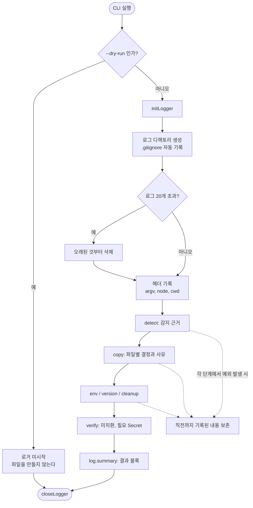

# 실행 추적이 남지 않아 원인 추적 불가

## 개요

설치 로그를 **결과 스냅샷(`.md`)에서 시간순 실행 추적(`.log`)으로 전면 교체**했다. 기존 구조는 설치가 모두 끝난 뒤 결과를 한 번에 렌더링하는 방식이라, 중간에 예외가 나면 로그가 0바이트였고 파일별로 어떤 판단을 왜 내렸는지도 남지 않았다. 이제 각 모듈이 판단하는 그 자리에서 즉시 파일에 append하며, 로그는 로컬 전용으로 전환해 상세도 제약을 없앴다.

## 기능 흐름



## 변경 사항

### 신설

- `src/core/logger.js`: 모듈 수준 싱글톤 로거. `initLogger` / `log.info|warn|fail` / `log.summary` / `closeLogger` / `resetLogger` / `currentLogPath` / `hasLegacyMdLogs` 제공. 호출 즉시 `appendFileSync`로 기록한다.

### 제거

- `src/core/install-log.js`: `.md` 스냅샷 생성기 전체 삭제. 존재하지 않는 필드(`skippedFiles`, `backupFiles`)를 참조하던 죽은 코드 두 곳이 함께 사라졌다.

### 계측 삽입

- `src/core/copy/workflows.js`: `classify()`의 다섯 버킷 판정을 사유와 함께 기록. `counters.unchangedFiles` 신설. `applyDecision`의 세 분기(backup / template / skip)에도 결정 사유를 남긴다.
- `src/commands/full.js`: 감지 근거, 질문별 응답, `version.yml` 기록, 이전 배포 방식 정리, 미치환 항목, 필요 Secret을 각 단계에서 기록하고 마지막에 요약 블록을 붙인다. `writeInstallLog` 호출과 `installLog` 반환값을 제거했다.
- `src/commands/uninstall.js`, `src/commands/purge.js`: 파일을 지우는 지점마다 대상과 분류를 기록.

### 배선

- `src/index.js`: `run()`을 얇은 래퍼로 분리하고 실제 구현을 `runInner()`로 옮겼다. 모드에 따라 `initLogger`를 호출하고, `finally`에서 `closeLogger`를 보장한다. 시각 계산(`clock || utcNow()`)을 진입부로 올려 로그 파일명과 설치 기록이 같은 값을 쓰도록 했다.
- `src/ui/summary.js`: 설치 요약 화면의 안내를 실행 로그 경로로 교체하고, git에 올라가지 않는다는 점을 명시. 구버전 `.md`가 추적 중이면 해제 방법을 안내한다.

### 테스트

- `tests/node/logger.test.js` (14건): 포맷, 레벨, 마스킹, `.gitignore` 생성, 회전, 크래시 내성, 쓰기 실패 시 no-op 전환
- `tests/node/logger-copy.test.js` (3건): 파일별 결정 사유 기록
- `tests/node/logger-full.test.js` (2건): 전 구간 계측과 요약 블록, `.md` 미생성
- `tests/node/logger-lifecycle.test.js` (4건): 모드별 로그 생성 여부, dry-run 제외
- `tests/node/verify-and-install-log.test.js` → `tests/node/verify.test.js`로 이름 변경, install-log 관련 테스트 이관

## 주요 구현 내용

### 왜 싱글톤 + 즉시 append인가

수집 방식으로 세 가지를 검토했다.

| 방식 | 판단 |
|---|---|
| 이벤트를 모아 종료 시 렌더링 | **탈락.** 기존 구조와 같아 크래시하면 로그가 통째로 사라진다. 디버깅에서 가장 알고 싶은 상황에서 정보가 0이 된다 |
| 로거 주입(DI) | 탈락. 격리는 완벽하지만 `detect` → `copy` → `env` → `verify` 호출 체인 전체의 시그니처를 바꿔야 해 기존 테스트 수백 건이 함께 흔들린다 |
| **모듈 수준 싱글톤** | **채택.** 시그니처 변경 없이 어디서든 계측할 수 있고, 호출 즉시 append라 죽기 직전까지가 남는다. CLI는 프로세스당 1회 실행이라 전역 상태의 위험이 낮다 |

테스트 격리는 `resetLogger()`로 해결했고, `initLogger` 없이 `log.*`를 호출하면 조용히 no-op이 된다. `runFull()`을 직접 호출하는 기존 테스트들이 로거를 몰라도 깨지지 않아야 하기 때문이다.

### 로컬 전용 전환과 `.gitignore` 자동 생성

로그를 커밋 대상으로 두면 상세도에 제약이 생긴다(diff 노이즈, 민감 정보 노출 위험). 로컬 전용으로 돌리되 루트 `.gitignore`는 건드리지 않았다 — 이 프로젝트는 "gitignore 자동 수정은 마법사 책임 범위 밖"(이슈 #7)이라는 결정을 이미 내렸기 때문이다.

대신 로그 디렉토리 안에 자체 `.gitignore`를 둔다.

```
.github/.wizard/logs/.gitignore
  *
  !.gitignore
```

폴더 하나로 경계가 닫히므로 uninstall이 `.github/.wizard`를 지울 때 흔적도 함께 사라진다.

### `copy` scope가 이번 작업의 핵심

`classify()`는 이미 파일을 `unchanged` / `localOnly` / `newFiles` / `upstreamOnly` / `changed` 다섯 버킷으로 나누고 있었지만, 그 판정이 전부 버려지고 있었다. 사유와 함께 남기면 업데이트에서 가장 자주 묻는 질문이 로그 한 줄로 해결된다.

```
07:46:03 INFO  copy      keep-local  PROJECT-COMMON-VERSION-CONTROL.yaml (업스트림 무변경, 사용자 수정본 유지)
07:46:03 INFO  copy      auto-update PROJECT-COMMON-AI-PR-SUMMARY.yaml (사용자 미수정, 최신으로 교체)
07:46:03 INFO  copy      backup      PROJECT-SPRING-PR-PREVIEW.yaml → .bak (사용자 결정, 새 버전으로 교체)
```

### 검증

- 자동화 테스트 **664건 전량 통과** (Node 509 + Python 155). 기존 642건에서 22건 추가, 회귀 0건.
- 실제 CLI e2e 5종 확인:
  1. 최초 설치 — 로그 1건 생성
  2. 워크플로우 수정 후 재설치 — `keep-local` 기록 + 사용자 수정본 보존 확인
  3. `--dry-run` — 로그 수 변화 없음
  4. `git add -A` 후 staged 확인 — `.log` 0개, `.gitignore`만 추적
  5. `uninstall` — 워크플로우와 `.wizard` 모두 제거

## 주의사항

**열 너비를 바꾸면 테스트가 함께 깨진다.** `SCOPE_W`(8)는 가장 긴 scope 이름 `baseline`에, `ACTION_W`(10)는 `keep-local` / `unresolved`에 맞춘 값이다. 테스트가 `copy {6}write {7}` 같이 칸 수를 직접 검증하므로 상수만 고치면 정규식이 어긋난다. scope나 action 이름을 추가할 때 기존 최댓값을 넘는지 먼저 확인해야 한다.

**라인 시각은 UTC다.** 헤더의 실행 시각과 파일명이 `utcNow()` 기준이라 라인도 `getUTCHours()`로 맞췄다. 구현 중 로컬 시간을 쓴 탓에 같은 파일 안에서 헤더는 `07:46`, 라인은 `16:46`으로 9시간 어긋나는 문제가 실제로 발생했다. 로컬 시각이 더 편해 보여도 셋 중 하나만 바꾸면 안 된다.

**`--dry-run`은 의도적으로 제외했다.** "파일을 바꾸지 않는다"가 이 모드의 계약이므로 로그 파일도 만들지 않는다. 설계 검토 중 dry-run에도 로그를 남기도록 적었다가 계약 위반임을 발견해 되돌렸다. 나중에 "dry-run도 기록되면 좋겠다"는 요구가 나오면 파일이 아니라 stdout으로 내보내야 한다.

**구버전 `.md` 로그는 자동으로 지우지 않는다.** `.gitignore`는 이미 git이 추적 중인 파일에는 영향이 없어서, 기존에 커밋된 `.md`는 그대로 남는다. 임의 삭제는 위험하므로 설치 요약 화면에 `git rm -r --cached .github/.wizard/logs` 안내만 출력한다.

**`run()`을 래퍼로 분리한 이유.** 본문 전체를 `try/finally`로 감싸면 300줄 가까운 코드의 들여쓰기가 전부 바뀌어 diff가 실질 변경을 가린다. 기존 본문을 `runInner()`로 두고 얇은 공개 래퍼만 추가해 들여쓰기 변경 없이 모든 return·예외 경로에서 `closeLogger`가 불리도록 했다.

**로거 실패는 설치를 멈추지 않는다.** 쓰기에 실패하면 첫 회에 한 번만 stderr로 알리고 이후 조용히 no-op으로 전환한다. 매 줄 경고를 뱉으면 설치 화면이 무너지고, 그렇다고 예외를 통째로 삼키면 기존 구조와 같은 문제(실패 무기록)로 돌아간다.

**향후 과제.** 로그를 읽어 해석하는 CLI 서브커맨드(`--mode logs` 등)는 이번 범위 밖으로 뒀다. 필요해지면 별도 과제로 다룬다.
