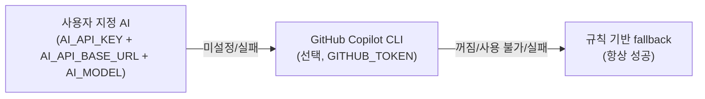

# GitHub Models 종료 대응 — Copilot CLI AI 엔진 교체 Implementation Plan

> **For agentic workers:** REQUIRED SUB-SKILL: Use superpowers:subagent-driven-development (recommended) or superpowers:executing-plans to implement this plan task-by-task. Steps use checkbox (`- [ ]`) syntax for tracking.

**Goal:** 종료된 GitHub Models 티어를 opt-in Copilot CLI 티어로 교체하고, 함께 죽어 있던 `AI_API_KEY` 티어 기본값·거짓 "AI Summary" 라벨·"API 키 0개" 문서를 바로잡는다.

**Architecture:** `changelog_manager.py`의 엔진 체인을 `사용자 AI_API_KEY(+URL+모델 필수) → Copilot CLI(opt-in) → rule-based fallback`으로 바꾼다. Copilot 사용 여부는 `version.yml`의 `metadata.template.options.copilot_ai`에 저장하고(마법사 질문·`--copilot/--no-copilot`), 워크플로우가 런타임에 읽어(`semver_auto`와 같은 방식) CLI 설치와 호출을 게이트한다. Copilot은 빈 임시 디렉터리에서 도구를 전부 막고 텍스트 생성 전용으로 호출하며, 어떤 실패도 fallback으로 흡수한다.

**Tech Stack:** Python 3 표준 라이브러리(`unittest`), Node.js ESM(`node:test`, 런타임 의존성 0), GitHub Actions YAML, `@github/copilot` CLI 1.0.88(고정).

**Spec:** GitHub 이슈 #134 (`https://github.com/Twin-Fang/project-auto-wizard/issues/134`), 로컬 사본 `.issue/#20260924_001_기능개선_GitHub_Models_종료_대응_Copilot_CLI_교체.md`

## Global Constraints

- 브랜치는 현재 체크아웃된 `20260924_#134_GitHub_Models_종료_대응_AI_요약_SemVer_보조_판정을_Copilot_CLI로_교체`에서 진행한다. **worktree를 만들지 않는다.** PR 대상은 `develop`.
- 커밋 메시지는 **한국어**, 타입 접두사(`feat:`, `fix:`, `docs:`, `test:` 등)만 영어 (프로젝트 CLAUDE.md).
- git force 계열 옵션(`-f`, `--force`, `reset --hard`, `branch -D`, `--no-verify` 등)을 절대 쓰지 않는다. `.gitignore`로 제외된 파일(`.issue/`)을 강제로 추적시키지 않는다.
- **런타임 의존성을 추가하지 않는다** (npm 패키지는 zero-dependency 원칙, Python은 표준 라이브러리만).
- `payload/`가 단일 진실이다. 다음 두 종류의 도그푸딩 사본을 반드시 동기화한다.
  - `.github/scripts/changelog_manager.py`는 `payload/scripts/changelog_manager.py`와 **바이트 동일**이어야 한다 (`diff`가 비어야 함).
  - `.github/workflows/PROJECT-COMMON-{AI-PR-SUMMARY,AUTO-CHANGELOG-CONTROL,RELEASE-PUBLISH}.yaml`은 payload 사본에서 `{{MAIN_BRANCH}}→main`, `{{DEVELOP_BRANCH}}→develop`만 치환한 것과 같아야 한다. 단 RELEASE-PUBLISH는 기준선(baseline)에 알려진 차이(NPM-PUBLISH 트리거 스텝, `actions: write`, 이슈 #90 주석)가 이미 있다 — 이 차이는 **그대로 두고** 새 차이를 만들지 않는다.
- Copilot CLI 버전은 `1.0.88`로 고정한다 (세 워크플로우가 같은 문자열을 쓴다). 기본 모델은 `claude-haiku-4.5`, 환경 변수 `COPILOT_MODEL`(저장소 변수 `vars.COPILOT_MODEL`)로 덮어쓴다.
- Copilot 호출 계약: 프롬프트는 `-p`, 응답만 `-s`, 그리고 `--no-ask-user --no-color --no-custom-instructions --disable-builtin-mcps --deny-tool=shell --deny-tool=write --deny-tool=url --model <model>`. `--allow-all*`/`--yolo`는 절대 쓰지 않는다. 타임아웃 90초, 빈 임시 디렉터리에서 실행, `stdin=DEVNULL`.
- 환경 변수 계약: `COPILOT_AI`(`true`일 때만 활성), `COPILOT_MODEL`(선택), `GITHUB_TOKEN`(인증). 사용자 API 티어는 `AI_API_KEY`+`AI_API_BASE_URL`+`AI_MODEL` **셋 다** 있어야 동작.
- 엔진 이름: `user-api` | `copilot` | `fallback` (`github-models`는 삭제). stdout 마지막 줄 JSON `{ok, engine, output}`과 종료 코드 0 계약을 유지한다. 경고는 stderr로만 낸다.
- 범위 밖(건드리지 않는다): `--max-ai-credits`, 코멘트 upsert, provider 추상화 리팩터링, Local LLM, Agentic Workflows 전환, RELEASE-PUBLISH `actions: write` 사본 불일치, `docs/`의 과거 설계 문서, 이 저장소 자신의 `version.yml`.
- 이슈 원안 그대로 구현한다. 이슈에 없는 로깅·기능·리팩터링을 덧붙이지 않는다.

## Review Focus

스펙이 암시하지만 개별 태스크 테스트가 놓치기 쉬운, 실제 사용자가 가장 먼저 겪을 입력 5가지 (각각 소유 태스크에 테스트가 있다).

1. **Copilot이 서두 없이 코드펜스로 통째로 감싼 응답이나 섹션 헤딩 없는 응답을 줄 때** — PR 코멘트·릴리스 노트에 그대로 들어가지 않고 fallback이 되어야 한다 (Task 1).
2. **`AI_API_KEY`만 넣고 URL/모델을 비운 사용자** — 키가 어떤 엔드포인트로도 전송되지 않고, 경고 후 다음 티어로 넘어가야 한다 (Task 1).
3. **opt-out(`copilot_ai` 없음/false) 저장소에 `GITHUB_TOKEN`이 있는 경우** — Copilot 프로세스가 절대 실행되지 않아야 한다 (Task 1, Task 3).
4. **CLI 미설치·타임아웃·비정상 종료·인증 실패** — 종료 코드 0과 "마지막 stdout 줄이 JSON" 계약이 깨지지 않고 fallback으로 끝나야 한다 (Task 1).
5. **`copilot_ai` 키가 없는 기존 설치를 마법사로 다시 돌릴 때** — 조용히 true가 되지 않고 false로 남으며, 대화형에서는 질문이 다시 나오고 저장된 값이 있으면 재질문하지 않아야 한다 (Task 2).

---

### Task 1: Python 엔진 — Copilot CLI 티어 추가, 죽은 기본값 제거

**Files:**
- Modify: `payload/scripts/changelog_manager.py` (imports 23-33행, `_ai_assisted_minor_upgrade` 383-407행, 엔진 체인 상수 695-698행, `cmd_ai_summary` 763-800행)
- Modify: `.github/scripts/changelog_manager.py` (payload와 바이트 동일하게 복사)
- Modify: `tests/py/test_ai_summary.py`
- Modify: `tests/py/test_classify_bump.py` (`TestAiAssistedBumpUpgrade` 클래스와 import)
- Create: `tests/py/test_copilot_engine.py`

**Interfaces:**
- Consumes: 없음 (Task 2·3과 독립).
- Produces (Task 3이 의존):
  - 환경 변수 `COPILOT_AI`, `COPILOT_MODEL`, `GITHUB_TOKEN`, `AI_API_KEY`, `AI_API_BASE_URL`, `AI_MODEL`
  - `changelog_manager.call_copilot_cli(prompt: str) -> str` (실패 시 예외)
  - `changelog_manager._copilot_enabled() -> bool`
  - `changelog_manager._user_api_settings() -> tuple[str, str, str] | None`
  - `changelog_manager._is_valid_copilot_summary(text: str) -> bool`
  - 상수 `_COPILOT_DEFAULT_MODEL = "claude-haiku-4.5"`, `_COPILOT_TIMEOUT_SECONDS = 90`
  - `ai-summary` 서브커맨드 stdout 마지막 줄 JSON의 `engine` ∈ {`user-api`, `copilot`, `fallback`}

- [ ] **Step 1: 새 테스트 파일 `tests/py/test_copilot_engine.py` 작성**

```python
import contextlib
import io
import json
import os
import shutil
import subprocess
import sys
import tempfile
import unittest
from pathlib import Path
from unittest.mock import patch
from urllib.error import URLError

SCRIPT_DIR = Path(__file__).resolve().parents[2] / "payload" / "scripts"
if str(SCRIPT_DIR) not in sys.path:
    sys.path.insert(0, str(SCRIPT_DIR))

import changelog_manager  # noqa: E402

VALID_SUMMARY = "## [1.2.3]\n\n### ✨ 기능\n- 로그인 추가\n"


def _completed(stdout="", returncode=0, stderr=""):
    return subprocess.CompletedProcess(args=["copilot"], returncode=returncode, stdout=stdout, stderr=stderr)


def _last_json_line(text):
    return json.loads([line for line in text.splitlines() if line.strip()][-1])


class TestIsValidCopilotSummary(unittest.TestCase):
    def test_accepts_response_with_section_heading(self):
        self.assertTrue(changelog_manager._is_valid_copilot_summary(VALID_SUMMARY))

    def test_rejects_empty_or_whitespace(self):
        self.assertFalse(changelog_manager._is_valid_copilot_summary(""))
        self.assertFalse(changelog_manager._is_valid_copilot_summary("  \n "))

    def test_rejects_response_without_any_section_heading(self):
        self.assertFalse(changelog_manager._is_valid_copilot_summary("## [1.2.3]\n\n- 로그인 추가\n"))
        self.assertFalse(changelog_manager._is_valid_copilot_summary("요약은 다음과 같습니다. 로그인이 추가되었습니다."))

    def test_rejects_response_wrapped_in_code_fence(self):
        fenced = "```markdown\n" + VALID_SUMMARY + "```\n"
        self.assertFalse(changelog_manager._is_valid_copilot_summary(fenced))


class TestCallCopilotCli(unittest.TestCase):
    def setUp(self):
        env_patcher = patch.dict(
            changelog_manager.os.environ,
            {"GITHUB_TOKEN": "ghs_test"},
            clear=True,
        )
        env_patcher.start()
        self.addCleanup(env_patcher.stop)

    def test_command_is_locked_down_text_only(self):
        with patch.object(changelog_manager.subprocess, "run", return_value=_completed("ok")) as mock_run:
            out = changelog_manager.call_copilot_cli("PROMPT")

        self.assertEqual(out, "ok")
        args = mock_run.call_args.args[0]
        self.assertEqual(args[0], "copilot")
        self.assertEqual(args[args.index("-p") + 1], "PROMPT")
        for flag in (
            "-s", "--no-ask-user", "--no-color", "--no-custom-instructions", "--disable-builtin-mcps",
            "--deny-tool=shell", "--deny-tool=write", "--deny-tool=url",
        ):
            self.assertIn(flag, args)
        for forbidden in ("--allow-all-tools", "--allow-all", "--yolo", "--allow-all-paths", "--allow-all-urls"):
            self.assertNotIn(forbidden, args)
        self.assertEqual(args[args.index("--model") + 1], changelog_manager._COPILOT_DEFAULT_MODEL)

    def test_model_can_be_overridden_by_env(self):
        changelog_manager.os.environ["COPILOT_MODEL"] = "my-model"
        with patch.object(changelog_manager.subprocess, "run", return_value=_completed("ok")) as mock_run:
            changelog_manager.call_copilot_cli("PROMPT")
        args = mock_run.call_args.args[0]
        self.assertEqual(args[args.index("--model") + 1], "my-model")

    def test_runs_in_empty_temp_dir_with_timeout_and_no_stdin(self):
        seen = {}

        def fake_run(args, **kwargs):
            seen["listing"] = os.listdir(kwargs["cwd"])
            seen["cwd"] = kwargs["cwd"]
            seen["timeout"] = kwargs["timeout"]
            seen["stdin"] = kwargs["stdin"]
            return _completed("ok")

        with patch.object(changelog_manager.subprocess, "run", side_effect=fake_run):
            changelog_manager.call_copilot_cli("PROMPT")

        self.assertEqual(seen["listing"], [])
        self.assertNotEqual(Path(seen["cwd"]).resolve(), Path.cwd().resolve())
        self.assertEqual(seen["timeout"], changelog_manager._COPILOT_TIMEOUT_SECONDS)
        self.assertEqual(seen["stdin"], subprocess.DEVNULL)

    def test_nonzero_exit_raises(self):
        with patch.object(
            changelog_manager.subprocess, "run",
            return_value=_completed("", returncode=1, stderr="Error: Authentication failed"),
        ):
            with self.assertRaises(RuntimeError) as ctx:
                changelog_manager.call_copilot_cli("PROMPT")
        self.assertIn("Authentication failed", str(ctx.exception))


class TestCopilotEngineChain(unittest.TestCase):
    def setUp(self):
        self.tmp = tempfile.mkdtemp()
        self.addCleanup(shutil.rmtree, self.tmp, ignore_errors=True)
        self.commits_file = Path(self.tmp) / "commits.txt"
        self.commits_file.write_text("feat: add login\nfix: crash on start\n", encoding="utf-8")
        self.output_file = Path(self.tmp) / "summary.md"
        env_patcher = patch.dict(changelog_manager.os.environ, {}, clear=True)
        env_patcher.start()
        self.addCleanup(env_patcher.stop)

    def _enable_copilot(self):
        changelog_manager.os.environ.update({"COPILOT_AI": "true", "GITHUB_TOKEN": "ghs_test"})

    def _run_capture(self):
        out_buf, err_buf = io.StringIO(), io.StringIO()
        with contextlib.redirect_stdout(out_buf), contextlib.redirect_stderr(err_buf):
            rc = changelog_manager.main([
                "ai-summary", "--commits-file", str(self.commits_file),
                "--version", "1.2.3", "--output", str(self.output_file),
            ])
        return rc, out_buf.getvalue(), err_buf.getvalue()

    def test_opted_in_uses_copilot_engine(self):
        self._enable_copilot()
        with patch.object(changelog_manager.subprocess, "run", return_value=_completed(VALID_SUMMARY)):
            rc, out, _ = self._run_capture()
        self.assertEqual(rc, 0)
        payload = _last_json_line(out)
        self.assertEqual(payload["engine"], "copilot")
        self.assertTrue(payload["ok"])
        self.assertEqual(self.output_file.read_text(encoding="utf-8"), VALID_SUMMARY)

    def test_opted_out_never_spawns_copilot_even_with_token(self):
        changelog_manager.os.environ["GITHUB_TOKEN"] = "ghs_test"
        with patch.object(changelog_manager.subprocess, "run") as mock_run:
            rc, out, _ = self._run_capture()
        self.assertEqual(rc, 0)
        mock_run.assert_not_called()
        self.assertEqual(_last_json_line(out)["engine"], "fallback")

    def test_copilot_flag_false_or_missing_token_never_spawns(self):
        changelog_manager.os.environ.update({"COPILOT_AI": "false", "GITHUB_TOKEN": "ghs_test"})
        with patch.object(changelog_manager.subprocess, "run") as mock_run:
            self._run_capture()
        mock_run.assert_not_called()

        changelog_manager.os.environ.pop("GITHUB_TOKEN")
        changelog_manager.os.environ["COPILOT_AI"] = "true"
        with patch.object(changelog_manager.subprocess, "run") as mock_run:
            self._run_capture()
        mock_run.assert_not_called()

    def test_invalid_format_falls_back(self):
        self._enable_copilot()
        for bad in ("", "요약입니다. 로그인이 추가되었습니다.", "```markdown\n" + VALID_SUMMARY + "```"):
            with self.subTest(bad=bad[:20]):
                with patch.object(changelog_manager.subprocess, "run", return_value=_completed(bad)):
                    rc, out, err = self._run_capture()
                self.assertEqual(rc, 0)
                self.assertEqual(_last_json_line(out)["engine"], "fallback")
                self.assertIn("[warn] copilot failed", err)

    def test_cli_failures_fall_back_with_exit_code_zero(self):
        self._enable_copilot()
        failures = (
            FileNotFoundError("copilot"),
            subprocess.TimeoutExpired(cmd="copilot", timeout=90),
            _completed("", returncode=1, stderr="Error: Authentication failed"),
        )
        for failure in failures:
            with self.subTest(failure=type(failure).__name__):
                kwargs = {"side_effect": failure} if isinstance(failure, Exception) else {"return_value": failure}
                with patch.object(changelog_manager.subprocess, "run", **kwargs):
                    rc, out, err = self._run_capture()
                self.assertEqual(rc, 0)
                payload = _last_json_line(out)
                self.assertEqual(payload["engine"], "fallback")
                self.assertTrue(payload["ok"])
                self.assertIn("[warn] copilot failed", err)

    def test_user_api_key_without_url_and_model_is_skipped_with_warning(self):
        changelog_manager.os.environ["AI_API_KEY"] = "sk-user-key"
        with patch.object(changelog_manager.urllib.request, "urlopen") as mock_urlopen:
            rc, out, err = self._run_capture()
        self.assertEqual(rc, 0)
        mock_urlopen.assert_not_called()
        self.assertEqual(_last_json_line(out)["engine"], "fallback")
        self.assertIn("::warning::", err)
        self.assertNotIn("::warning::", out)

    def test_partial_user_api_settings_are_skipped(self):
        for env in (
            {"AI_API_KEY": "sk", "AI_API_BASE_URL": "https://api.example.com/v1"},
            {"AI_API_KEY": "sk", "AI_MODEL": "m"},
        ):
            with self.subTest(env=sorted(env)):
                with patch.dict(changelog_manager.os.environ, env):
                    with patch.object(changelog_manager.urllib.request, "urlopen") as mock_urlopen:
                        self._run_capture()
                mock_urlopen.assert_not_called()

    def test_skipped_user_api_lets_copilot_run(self):
        changelog_manager.os.environ["AI_API_KEY"] = "sk-user-key"
        self._enable_copilot()
        with patch.object(changelog_manager.subprocess, "run", return_value=_completed(VALID_SUMMARY)):
            _, out, err = self._run_capture()
        self.assertEqual(_last_json_line(out)["engine"], "copilot")
        self.assertIn("::warning::", err)

    def test_user_api_failure_chains_to_copilot(self):
        changelog_manager.os.environ.update({
            "AI_API_KEY": "sk", "AI_API_BASE_URL": "https://api.example.com/v1", "AI_MODEL": "m",
        })
        self._enable_copilot()
        with patch.object(changelog_manager.urllib.request, "urlopen", side_effect=URLError("refused")):
            with patch.object(changelog_manager.subprocess, "run", return_value=_completed(VALID_SUMMARY)):
                _, out, err = self._run_capture()
        self.assertEqual(_last_json_line(out)["engine"], "copilot")
        self.assertIn("[warn] user-api failed", err)


if __name__ == "__main__":
    unittest.main()
```

- [ ] **Step 2: `tests/py/test_ai_summary.py` 수정 (GitHub Models 전제 제거 + 사용자 API 환경 3종 필수)**

(a) 파일 상단 import에 `subprocess` 추가 — `import shutil` 다음 줄에 `import subprocess`를 넣는다.

(b) 클래스 `TestAiSummary`의 `_run_main` 바로 위에 헬퍼를 추가한다:

```python
    def _set_user_api_env(self):
        changelog_manager.os.environ.update({
            "AI_API_KEY": "sk-user-key",
            "AI_API_BASE_URL": "https://api.example.com/v1",
            "AI_MODEL": "example-model",
        })

```

(c) 아래 세 테스트를 **통째로** 교체한다 (원문 이름 기준).

`test_github_token_fallback_to_models_endpoint` 전체 →

```python
    def test_github_token_alone_no_longer_calls_network_or_copilot(self):
        changelog_manager.os.environ["GITHUB_TOKEN"] = "ghp_test_token"

        with patch.object(changelog_manager.urllib.request, "urlopen") as mock_urlopen:
            with patch.object(changelog_manager.subprocess, "run") as mock_run:
                rc, payload, _ = self._run_main_capture()

        self.assertEqual(rc, 0)
        self.assertEqual(payload["engine"], "fallback")
        mock_urlopen.assert_not_called()
        mock_run.assert_not_called()
```

`test_tier1_failure_chains_to_github_models` 전체 →

```python
    def test_tier1_failure_chains_to_copilot(self):
        self._set_user_api_env()
        changelog_manager.os.environ.update({"COPILOT_AI": "true", "GITHUB_TOKEN": "ghp_test_token"})
        completed = subprocess.CompletedProcess(
            args=["copilot"], returncode=0, stdout="## [1.2.3]\n\n### ✨ 기능\n- tier2 summary\n", stderr="",
        )

        with patch.object(changelog_manager.urllib.request, "urlopen", side_effect=URLError("connection refused")) as mock_urlopen:
            with patch.object(changelog_manager.subprocess, "run", return_value=completed):
                rc, payload, stderr = self._run_main_capture()

        self.assertEqual(rc, 0)
        self.assertTrue(payload["ok"])
        self.assertEqual(payload["engine"], "copilot")
        self.assertEqual(mock_urlopen.call_count, 1)
        self.assertIn("[warn] user-api failed", stderr)
        self.assertIn("tier2 summary", self.output_file.read_text(encoding="utf-8"))
```

`test_urlerror_falls_back` 전체 →

```python
    def test_copilot_failure_falls_back(self):
        changelog_manager.os.environ.update({"COPILOT_AI": "true", "GITHUB_TOKEN": "ghp_test_token"})

        with patch.object(changelog_manager.subprocess, "run", side_effect=FileNotFoundError("copilot")):
            rc, payload, stderr = self._run_main_capture()

        self.assertEqual(rc, 0)
        self.assertEqual(payload["engine"], "fallback")
        self.assertIn("[warn] copilot failed", stderr)
        content = self.output_file.read_text(encoding="utf-8")
        self.assertTrue(len(content.strip()) > 0)
```

(d) 남은 모든 `changelog_manager.os.environ["AI_API_KEY"] = "sk-user-key"` 줄을 헬퍼 호출로 바꾼다 (BSD sed):

Run: `sed -i '' 's/changelog_manager\.os\.environ\["AI_API_KEY"\] = "sk-user-key"/self._set_user_api_env()/' tests/py/test_ai_summary.py`
Then: `grep -n 'AI_API_KEY"\] = ' tests/py/test_ai_summary.py` — Expected: 출력 없음.

(e) `test_http_error_429_falls_back_to_rule_based` 안의 종료된 엔드포인트 문자열을 중립 URL로 바꾼다. 기존: `            url="https://models.github.ai/inference/chat/completions",` → 변경: `            url="https://api.example.com/v1/chat/completions",`

- [ ] **Step 3: `tests/py/test_classify_bump.py`의 AI 보조 테스트 클래스 교체**

(a) 파일 상단 import에 `import subprocess`를 `import shutil` 다음 줄에 추가한다.

(b) `class TestAiAssistedBumpUpgrade(unittest.TestCase):` 부터 그 클래스의 마지막 줄(`mock_urlopen.assert_not_called()`)까지를 아래로 통째로 교체한다.

```python
class TestAiAssistedBumpUpgrade(unittest.TestCase):
    def setUp(self):
        self.tmp = tempfile.mkdtemp()
        self.addCleanup(shutil.rmtree, self.tmp, ignore_errors=True)
        self.env_patcher = unittest.mock.patch.dict(changelog_manager.os.environ, {}, clear=True)
        self.env_patcher.start()
        self.addCleanup(self.env_patcher.stop)

    def _set_user_api_env(self):
        changelog_manager.os.environ.update({
            "AI_API_KEY": "sk-test",
            "AI_API_BASE_URL": "https://api.example.com/v1",
            "AI_MODEL": "example-model",
        })

    def _enable_copilot(self):
        changelog_manager.os.environ.update({"COPILOT_AI": "true", "GITHUB_TOKEN": "ghs_test"})

    def _completed(self, stdout, returncode=0):
        return subprocess.CompletedProcess(args=["copilot"], returncode=returncode, stdout=stdout, stderr="")

    def _run(self, commit_lines):
        import contextlib
        import io
        commits_file = Path(self.tmp) / "commits.txt"
        commits_file.write_text("\n".join(commit_lines) + "\n", encoding="utf-8")
        out = io.StringIO()
        with contextlib.redirect_stdout(out):
            rc = changelog_manager.main(["classify-bump", "--commits-file", str(commits_file)])
        return rc, out.getvalue().strip().splitlines()[-1]

    def _mock_response(self, content):
        m = unittest.mock.MagicMock()
        m.read.return_value = ('{"choices":[{"message":{"content":"%s"}}]}' % content).encode("utf-8")
        m.__enter__.return_value = m
        m.__exit__.return_value = False
        return m

    def test_ai_upgrades_patch_to_minor_when_response_is_MINOR(self):
        self._set_user_api_env()
        with unittest.mock.patch.object(
            changelog_manager.urllib.request, "urlopen", return_value=self._mock_response("MINOR"),
        ):
            rc, last_line = self._run(["add dark mode toggle to settings screen"])
        self.assertEqual(rc, 0)
        self.assertEqual(last_line, "minor")

    def test_ai_keeps_patch_when_response_is_PATCH(self):
        self._set_user_api_env()
        with unittest.mock.patch.object(
            changelog_manager.urllib.request, "urlopen", return_value=self._mock_response("PATCH"),
        ):
            rc, last_line = self._run(["tweak internal logging format"])
        self.assertEqual(rc, 0)
        self.assertEqual(last_line, "patch")

    def test_ai_never_produces_major(self):
        self._set_user_api_env()
        with unittest.mock.patch.object(
            changelog_manager.urllib.request, "urlopen", return_value=self._mock_response("MAJOR"),
        ):
            rc, last_line = self._run(["completely rewrite the public API"])
        self.assertEqual(rc, 0)
        # 응답이 형식을 안 지키면(정확히 MINOR가 아니면) 규칙 결과 patch로 확정 — major는 나올 수 없음.
        self.assertEqual(last_line, "patch")

    def test_ai_call_failure_falls_back_to_rule_result(self):
        self._set_user_api_env()
        with unittest.mock.patch.object(
            changelog_manager.urllib.request, "urlopen", side_effect=URLError("timed out"),
        ):
            rc, last_line = self._run(["random freeform commit message"])
        self.assertEqual(rc, 0)
        self.assertEqual(last_line, "patch")

    def test_no_api_key_no_token_skips_ai_and_stays_patch(self):
        rc, last_line = self._run(["random freeform commit message"])
        self.assertEqual(rc, 0)
        self.assertEqual(last_line, "patch")

    def test_feat_result_never_calls_ai(self):
        with unittest.mock.patch.object(changelog_manager.urllib.request, "urlopen") as mock_urlopen:
            rc, last_line = self._run(["feat: add login"])
        self.assertEqual(last_line, "minor")
        mock_urlopen.assert_not_called()

    def test_user_key_without_url_and_model_sends_nothing(self):
        changelog_manager.os.environ["AI_API_KEY"] = "sk-test"
        with unittest.mock.patch.object(changelog_manager.urllib.request, "urlopen") as mock_urlopen:
            rc, last_line = self._run(["add dark mode toggle to settings screen"])
        self.assertEqual(rc, 0)
        self.assertEqual(last_line, "patch")
        mock_urlopen.assert_not_called()

    def test_copilot_upgrades_patch_to_minor_when_response_is_exactly_MINOR(self):
        self._enable_copilot()
        with unittest.mock.patch.object(
            changelog_manager.subprocess, "run", return_value=self._completed("MINOR\n"),
        ) as mock_run:
            rc, last_line = self._run(["add dark mode toggle to settings screen"])
        self.assertEqual(rc, 0)
        self.assertEqual(last_line, "minor")
        mock_run.assert_called_once()

    def test_copilot_response_other_than_exactly_MINOR_stays_patch(self):
        self._enable_copilot()
        for response in ("PATCH", "MAJOR", "MINOR because it adds a feature", ""):
            with self.subTest(response=response):
                with unittest.mock.patch.object(
                    changelog_manager.subprocess, "run", return_value=self._completed(response),
                ):
                    rc, last_line = self._run(["add dark mode toggle to settings screen"])
                self.assertEqual(rc, 0)
                self.assertEqual(last_line, "patch")

    def test_copilot_disabled_never_spawns_even_with_token(self):
        changelog_manager.os.environ["GITHUB_TOKEN"] = "ghs_test"
        with unittest.mock.patch.object(changelog_manager.subprocess, "run") as mock_run:
            rc, last_line = self._run(["add dark mode toggle to settings screen"])
        self.assertEqual(last_line, "patch")
        mock_run.assert_not_called()

    def test_copilot_failure_stays_patch(self):
        self._enable_copilot()
        with unittest.mock.patch.object(
            changelog_manager.subprocess, "run", side_effect=FileNotFoundError("copilot"),
        ):
            rc, last_line = self._run(["add dark mode toggle to settings screen"])
        self.assertEqual(rc, 0)
        self.assertEqual(last_line, "patch")

    def test_user_api_failure_chains_to_copilot(self):
        self._set_user_api_env()
        self._enable_copilot()
        with unittest.mock.patch.object(
            changelog_manager.urllib.request, "urlopen", side_effect=URLError("timed out"),
        ):
            with unittest.mock.patch.object(
                changelog_manager.subprocess, "run", return_value=self._completed("MINOR"),
            ):
                rc, last_line = self._run(["add dark mode toggle to settings screen"])
        self.assertEqual(last_line, "minor")
```

- [ ] **Step 4: 실패 확인**

Run: `python3 -m unittest discover -s tests/py -p "test_copilot_engine.py" -v 2>&1 | tail -20`
Expected: FAIL/ERROR — `AttributeError: module 'changelog_manager' has no attribute '_is_valid_copilot_summary'` (아직 구현 없음).

Run: `python3 -m unittest discover -s tests/py -p "test_ai_summary.py" -v 2>&1 | tail -20`
Expected: 일부 FAIL (GitHub Models 전제 제거·URL/모델 필수화 테스트).

- [ ] **Step 5: `payload/scripts/changelog_manager.py` 구현**

(a) import — `import re` 뒤와 `import sys` 뒤를 아래처럼 만든다 (알파벳 순 유지).

기존:
```python
import re
import sys
import traceback
```
변경:
```python
import re
import subprocess
import sys
import tempfile
import traceback
```

(b) `_ai_assisted_minor_upgrade` 함수 본문(383-407행)을 아래로 교체한다.

```python
def _ai_assisted_minor_upgrade(unclassified_lines: list[str]) -> bool:
    """규칙 분류가 patch일 때, 미분류 자유형식 커밋에 한해 AI에게 minor 업그레이드
    여부만 보조 판단시킨다. AI는 절대 major를 만들 수 없다 — major는 항상 명시적
    `!` 마커만 신뢰한다(classify_bump_level에서 이미 확정됨). 응답이 정확히
    'MINOR'가 아니거나 호출이 실패하면 무조건 False(규칙 결과 patch 유지)."""
    if not unclassified_lines:
        return False
    prompt = _BUMP_AI_PROMPT_PREFIX + "\n".join(f"- {line}" for line in unclassified_lines)

    settings = _user_api_settings()
    if settings:
        api_key, base_url, model = settings
        try:
            return call_openai_compatible(base_url, api_key, model, prompt).strip() == 'MINOR'
        except Exception as e:
            print(f"[warn] bump AI assist failed: {e}", file=sys.stderr)

    if _copilot_enabled():
        try:
            return call_copilot_cli(prompt).strip() == 'MINOR'
        except Exception as e:
            print(f"[warn] bump AI assist (copilot) failed: {e}", file=sys.stderr)
    return False
```

(c) 엔진 체인 상수(695-698행: `# ---- ai-summary 엔진 체인 ----` 헤더 아래 `_AI_DEFAULT_BASE_URL`, `_AI_DEFAULT_MODEL` 두 줄)를 아래 블록으로 교체한다. (`_build_ai_prompt` 정의 바로 위에 위치)

```python
_COPILOT_DEFAULT_MODEL = "claude-haiku-4.5"
_COPILOT_TIMEOUT_SECONDS = 90


def _user_api_settings() -> tuple[str, str, str] | None:
    """사용자 지정 AI 티어 설정. AI_API_KEY와 AI_API_BASE_URL, AI_MODEL이 모두 있어야 한다.

    키만 있고 URL·모델이 비어 있으면 그 키를 어디로도 보내지 않고 경고 후 건너뛴다
    (종료된 GitHub Models 기본값으로 사용자 키가 흘러가던 문제 방지)."""
    api_key = os.environ.get('AI_API_KEY')
    if not api_key:
        return None
    base_url = os.environ.get('AI_API_BASE_URL')
    model = os.environ.get('AI_MODEL')
    if not base_url or not model:
        print(
            "::warning::AI_API_KEY가 설정됐지만 AI_API_BASE_URL/AI_MODEL이 없어 사용자 API 티어를 건너뜁니다",
            file=sys.stderr,
        )
        return None
    return api_key, base_url, model


def _copilot_enabled() -> bool:
    """version.yml의 copilot_ai가 켜져 있고(워크플로우가 COPILOT_AI로 전달) 토큰이 있을 때만 True."""
    return os.environ.get('COPILOT_AI', '').strip().lower() == 'true' and bool(os.environ.get('GITHUB_TOKEN'))


def call_copilot_cli(prompt: str) -> str:
    """Copilot CLI를 텍스트 생성 전용으로 호출해 응답 텍스트를 반환.

    프롬프트에 필요한 정보가 이미 다 들어 있으므로 에이전트 기능은 전부 막는다:
    빈 임시 디렉터리에서 실행하고, shell/write/url 도구를 거부하며, 내장 MCP와
    커스텀 지침 로딩을 끈다.
    실패(비정상 종료·타임아웃·CLI 없음)는 예외로 올려 호출부가 fallback한다."""
    model = os.environ.get('COPILOT_MODEL') or _COPILOT_DEFAULT_MODEL
    with tempfile.TemporaryDirectory() as workdir:
        result = subprocess.run(
            [
                'copilot', '-p', prompt, '-s',
                '--no-ask-user', '--no-color', '--no-custom-instructions', '--disable-builtin-mcps',
                '--deny-tool=shell', '--deny-tool=write', '--deny-tool=url',
                '--model', model,
            ],
            cwd=workdir, stdin=subprocess.DEVNULL,
            capture_output=True, text=True, timeout=_COPILOT_TIMEOUT_SECONDS,
        )
    if result.returncode != 0:
        raise RuntimeError(f"copilot exited with {result.returncode}: {result.stderr.strip()[:200]}")
    return result.stdout


def _is_valid_copilot_summary(text: str) -> bool:
    """프롬프트가 요구한 Markdown 형식인지 최소한만 검사한다.

    섹션 헤딩('### ')이 하나도 없거나 코드펜스로 시작하는(통째로 감싼) 응답은 릴리스 노트로
    쓰지 않는다."""
    stripped = text.strip()
    if not stripped or stripped.startswith('```'):
        return False
    return any(line.startswith('### ') for line in stripped.splitlines())
```

(d) `cmd_ai_summary`에서 763-800행(`ai_api_key = ...`부터 `engine = "fallback"`까지)을 아래로 교체한다.

```python
    engine = None
    summary_text = None
    prompt = _build_ai_prompt(commit_lines, pr_title, version, diff_stat)

    settings = _user_api_settings()
    if settings:
        ai_api_key, ai_base_url, ai_model = settings
        try:
            candidate = call_openai_compatible(ai_base_url, ai_api_key, ai_model, prompt)
            if candidate and candidate.strip():
                summary_text = candidate
                engine = "user-api"
            else:
                print("[warn] user-api failed: empty content in response", file=sys.stderr)
        except Exception as e:
            print(f"[warn] user-api failed: {e}", file=sys.stderr)

    if summary_text is None and _copilot_enabled():
        try:
            candidate = call_copilot_cli(prompt)
            if _is_valid_copilot_summary(candidate):
                summary_text = candidate
                engine = "copilot"
            else:
                print("[warn] copilot failed: empty or not in the requested Markdown format", file=sys.stderr)
        except Exception as e:
            print(f"[warn] copilot failed: {e}", file=sys.stderr)

    if summary_text is None:
        classified = classify_commits(commit_lines)
        summary_text = render_fallback_md(classified, version)
        engine = "fallback"
```

(e) `_parse_markdown_sections`의 docstring(126행)에 남은 GitHub Models 언급을 고친다. 기존: `    AI 엔진 체인(사용자 지정 API → GitHub Models)과 규칙 기반 폴백이` → 변경: `    AI 엔진 체인(사용자 지정 API → Copilot CLI)과 규칙 기반 폴백이`

- [ ] **Step 6: 통과 확인**

Run: `python3 -m unittest discover -s tests/py -p "test_copilot_engine.py" -v 2>&1 | tail -30`
Expected: 전부 PASS.

Run: `python3 -m unittest discover -s tests/py -v 2>&1 | tail -15`
Expected: `OK` (파이썬 전체 스위트 통과).

Run: `grep -n -i "_AI_DEFAULT\|models\.github\|github-models\|GitHub Models" payload/scripts/changelog_manager.py tests/py/*.py`
Expected: 출력 없음. (단 `tests/py/test_copilot_engine.py`·`test_ai_summary.py`에 테스트 이름/주석으로 "GitHub Models"가 들어갔다면 그 줄을 정정한다.)

- [ ] **Step 7: 도그푸딩 사본 동기화**

Run: `cp payload/scripts/changelog_manager.py .github/scripts/changelog_manager.py && diff payload/scripts/changelog_manager.py .github/scripts/changelog_manager.py && echo IDENTICAL`
Expected: `IDENTICAL`

- [ ] **Step 8: Commit**

```bash
git add payload/scripts/changelog_manager.py .github/scripts/changelog_manager.py tests/py/test_ai_summary.py tests/py/test_classify_bump.py tests/py/test_copilot_engine.py
git commit -m "$(cat <<'EOF'
feat: GitHub Models 티어를 opt-in Copilot CLI로 교체하고 죽은 API 기본값 제거 (#134)
EOF
)"
```

---

### Task 2: `copilot_ai` 옵션 배선 (version.yml · CLI · 마법사 · status)

**Files:**
- Modify: `payload/version.yml.template` (헤더 주석 5-8행, options 블록 49행)
- Modify: `src/core/version-yml.js` (47-53행, 84-90행, 207행, 246행, 276행, 284행)
- Modify: `src/context.js` (29행)
- Modify: `src/cli/args.js` (17행, 136-141행)
- Modify: `src/cli/help.js` (26행)
- Modify: `src/index.js` (292행)
- Modify: `src/commands/interactive.js` (90행, 152-160행, 280행)
- Modify: `src/commands/status.js` (71-73행)
- Create: `tests/node/copilot-ai-option.test.js`

**Interfaces:**
- Consumes: 없음 (Task 1과 독립).
- Produces (Task 3이 의존):
  - version.yml 키 `metadata.template.options.copilot_ai: true|false` (신규 설치 기본 `false`)
  - `parseTemplateOptions(content).copilotAi: boolean|null`
  - `createContext({ includeCopilotAi })`, `parseArgs()`의 `includeCopilotAi: boolean|null`
  - CLI 플래그 `--copilot` / `--no-copilot`

- [ ] **Step 1: 실패하는 테스트 `tests/node/copilot-ai-option.test.js` 작성**

```js
// tests/node/copilot-ai-option.test.js
// 이슈 #134 — Copilot AI 요약 opt-in 옵션(copilot_ai). 기본값은 항상 false이고,
// 저장값이 있으면 재질문하지 않으며, 키가 없는 기존 설치는 조용히 true가 되지 않는다.
import { test } from "node:test";
import assert from "node:assert";
import { mkdtempSync, readFileSync, writeFileSync, rmSync } from "node:fs";
import { join } from "node:path";
import { tmpdir } from "node:os";
import { parseArgs, CliError } from "../../src/cli/args.js";
import { HELP_TEXT } from "../../src/cli/help.js";
import { run } from "../../src/index.js";
import { parseTemplateOptions, buildVersionYml } from "../../src/core/version-yml.js";
import { readVersionYmlTemplate, resolvePayloadRoot } from "../../src/core/assets.js";
import { printStatus } from "../../src/commands/status.js";
import { runInteractive } from "../../src/commands/interactive.js";

const CLOCK = { now: "2026-07-28 00:00:00", today: "2026-07-28" };

function optionsYml(extraLine) {
  return [
    "metadata:", "  template:", "    options:", "      nexus: false",
    ...(extraLine ? [extraLine] : []),
    "      secret_backup: false",
  ].join("\n");
}

async function install(target, extraArgs = []) {
  return run(["--mode", "full", "--force", "--type", "node", ...extraArgs], { cwd: target, clock: CLOCK });
}

function tempProject() {
  const target = mkdtempSync(join(tmpdir(), "paw-copilot-"));
  writeFileSync(join(target, "package.json"), "{}\n"); // 경로 후보 0개 방지용 루트 마커
  return target;
}

const savedOptions = (target) => parseTemplateOptions(readFileSync(join(target, "version.yml"), "utf8"));

test("parseTemplateOptions: copilot_ai true/false/미기재를 구분한다", () => {
  assert.strictEqual(parseTemplateOptions(optionsYml("      copilot_ai: true")).copilotAi, true);
  assert.strictEqual(parseTemplateOptions(optionsYml("      copilot_ai: false")).copilotAi, false);
  assert.strictEqual(parseTemplateOptions(optionsYml("")).copilotAi, null);
});

function build(templateOptions) {
  return buildVersionYml({
    templateText: readVersionYmlTemplate(resolvePayloadRoot()),
    version: "1.0.0", types: ["basic"], branch: "main",
    branches: { main: "main", develop: "develop", mode: "pr-flow" },
    versionCode: 1, ...CLOCK,
    templateOptions: { templateVersion: "0.1.0", ...templateOptions },
  });
}

test("buildVersionYml: includeCopilotAi 미지정은 false, true는 true로 렌더된다", () => {
  assert.strictEqual(parseTemplateOptions(build({})).copilotAi, false);
  assert.strictEqual(parseTemplateOptions(build({ includeCopilotAi: true })).copilotAi, true);
  assert.strictEqual(parseTemplateOptions(build({ includeCopilotAi: false })).copilotAi, false);
});

test("parseArgs: --copilot / --no-copilot / 미지정", () => {
  const base = ["--mode", "full", "--force", "--type", "node"];
  assert.strictEqual(parseArgs([...base, "--copilot"]).includeCopilotAi, true);
  assert.strictEqual(parseArgs([...base, "--no-copilot"]).includeCopilotAi, false);
  assert.strictEqual(parseArgs(base).includeCopilotAi, null);
});

test("parseArgs: --copilot과 --no-copilot 동시 지정은 CliError", () => {
  assert.throws(() => parseArgs(["--copilot", "--no-copilot"]), CliError);
  assert.throws(() => parseArgs(["--no-copilot", "--copilot"]), CliError);
});

test("help: --copilot 옵션과 AI Credits 소비를 안내한다", () => {
  assert.ok(HELP_TEXT.includes("--copilot / --no-copilot"));
  assert.ok(HELP_TEXT.includes("AI Credits"));
});

test("run(): 미지정이면 신규 설치도 copilot_ai: false (opt-in)", async () => {
  const target = tempProject();
  try {
    await install(target);
    assert.strictEqual(savedOptions(target).copilotAi, false);
  } finally {
    rmSync(target, { recursive: true, force: true });
  }
});

test("run(): --copilot은 version.yml에 저장되고, 플래그 없는 재실행도 저장값을 유지하며, --no-copilot으로 끌 수 있다", async () => {
  const target = tempProject();
  try {
    await install(target, ["--copilot"]);
    assert.strictEqual(savedOptions(target).copilotAi, true);

    await install(target);
    assert.strictEqual(savedOptions(target).copilotAi, true, "플래그 없는 재실행은 저장값을 유지");

    await install(target, ["--no-copilot"]);
    assert.strictEqual(savedOptions(target).copilotAi, false);
  } finally {
    rmSync(target, { recursive: true, force: true });
  }
});

test("run(): copilot_ai 키가 없는 기존 설치를 재실행해도 조용히 true가 되지 않는다", async () => {
  const target = tempProject();
  try {
    await install(target);
    const vyPath = join(target, "version.yml");
    const stripped = readFileSync(vyPath, "utf8")
      .split("\n")
      .filter((line) => !/^\s+copilot_ai:/.test(line))
      .join("\n");
    writeFileSync(vyPath, stripped);
    assert.strictEqual(parseTemplateOptions(stripped).copilotAi, null, "fixture setup: key must be absent");

    assert.strictEqual(await install(target), 0);
    assert.strictEqual(savedOptions(target).copilotAi, false);
  } finally {
    rmSync(target, { recursive: true, force: true });
  }
});

function renderStatus(status) {
  const originalLog = console.log;
  let output = "";
  console.log = (msg) => { output += msg; };
  try {
    printStatus(status);
  } finally {
    console.log = originalLog;
  }
  return output;
}

test("printStatus: copilot_ai 값과 미설정 상태를 옵션 줄에 표시한다", () => {
  const base = { installed: true, version: "1.0.0", templateVersion: "0.1.0", types: ["basic"], branches: null, modifiedFiles: [] };
  const on = renderStatus({ ...base, options: { nexus: false, secretBackup: false, semverAuto: true, copilotAi: true } });
  assert.ok(on.includes("copilot_ai=true"));
  const unset = renderStatus({ ...base, options: { nexus: false, secretBackup: false, semverAuto: true, copilotAi: null } });
  assert.ok(unset.includes("copilot_ai=미설정(기본 false)"));
});

// 스텁 io는 interactive-flutter.test.js와 같은 방식이다. 하네스가 요구하는 메서드가 더 있으면
// 그 파일의 stubIo를 참고해 같은 형태로 추가한다.
function stubIo(asked, copilotAnswer) {
  return {
    selectMode: async () => "full",
    confirmProjectMenu: async () => "continue",
    confirmTypes: async ({ types }) => types,
    selectDeployStyle: async () => "simple",
    selectBranchStrategy: async () => "pr-flow",
    askYesNo: async (message, def) => {
      asked.push({ message, def });
      return message.includes("Copilot") ? copilotAnswer : def;
    },
    askText: async (_message, def) => def,
    note: () => {}, cancelMessage: () => {}, summary: () => {}, outro: () => {},
    editMenu: async () => "done",
  };
}

test("interactive: Copilot 질문은 기본값 No로 나오고 답을 저장하며, 저장값이 있으면 재질문하지 않는다", async () => {
  const target = tempProject();
  try {
    const first = [];
    assert.strictEqual(await runInteractive({}, { cwd: target, io: stubIo(first, true) }), 0);
    const question = first.find((q) => q.message.includes("Copilot"));
    assert.ok(question, "Copilot 질문이 나와야 한다");
    assert.strictEqual(question.def, false, "기본값은 No");
    assert.ok(question.message.includes("AI Credits"), "비용 소비를 질문에 밝혀야 한다");
    assert.strictEqual(savedOptions(target).copilotAi, true);

    const second = [];
    assert.strictEqual(await runInteractive({}, { cwd: target, io: stubIo(second, false) }), 0);
    assert.ok(!second.some((q) => q.message.includes("Copilot")), "저장값이 있으면 재질문하지 않는다");
    assert.strictEqual(savedOptions(target).copilotAi, true);
  } finally {
    rmSync(target, { recursive: true, force: true });
  }
});

test("interactive: Copilot 질문에 기본값(No)으로 답하면 false로 저장된다", async () => {
  const target = tempProject();
  try {
    const asked = [];
    await runInteractive({}, { cwd: target, io: stubIo(asked, false) });
    assert.strictEqual(savedOptions(target).copilotAi, false);
  } finally {
    rmSync(target, { recursive: true, force: true });
  }
});
```

- [ ] **Step 2: 실패 확인**

Run: `node --test --test-concurrency=1 tests/node/copilot-ai-option.test.js 2>&1 | tail -40`
Expected: FAIL — `copilotAi`가 `undefined`, `--copilot` 미지원 등.

- [ ] **Step 3: `payload/version.yml.template` 수정**

헤더 주석(5-8행)의 semver 설명 뒤에 두 줄을 추가한다. 기존:
```
#   type bumps major. Set semver_auto: false to always patch-bump instead
#   (then edit major/minor manually, e.g., 1.0.5 -> 1.1.0 or 2.0.0).
# ===
```
변경:
```
#   type bumps major. Set semver_auto: false to always patch-bump instead
#   (then edit major/minor manually, e.g., 1.0.5 -> 1.1.0 or 2.0.0).
# - copilot_ai: opt-in (default false) — true lets the release/PR summary
#   workflows call GitHub Copilot CLI, which consumes GitHub Copilot AI Credits.
#   Falls back to rule-based summaries whenever Copilot is off or unavailable.
# ===
```
그리고 options 블록에서 `      semver_auto: {{OPT_SEMVER_AUTO}}` 바로 아래에 한 줄을 추가한다.
```
      copilot_ai: {{OPT_COPILOT_AI}}
```

- [ ] **Step 4: `src/core/version-yml.js` 수정**

(a) 47-48행 주석에 필드를 알린다. 기존:
```js
// 반환: { nexus: bool|null, secretBackup: bool|null, semverAuto: bool|null, deployStyle: string|null,
```
변경:
```js
// 반환: { nexus: bool|null, secretBackup: bool|null, semverAuto: bool|null, copilotAi: bool|null, deployStyle: string|null,
```

(b) 53행. 기존: `    nexus: null, secretBackup: null, semverAuto: null, deployStyle: null,` → 변경: `    nexus: null, secretBackup: null, semverAuto: null, copilotAi: null, deployStyle: null,`

(c) `semver_auto` 파싱 블록(84-90행) 바로 뒤에 추가한다.
```js
      m = line.match(/^\s+copilot_ai:\s*(.+)/);
      if (m) {
        const v = strip(m[1]);
        if (v === "true") out.copilotAi = true;
        if (v === "false") out.copilotAi = false;
        continue;
      }
```

(d) `buildVersionYml` 구조분해(207행). 기존: `    includeSemverAuto = true, deployStyle = "", optionsDate = today,` → 변경: `    includeSemverAuto = true, includeCopilotAi = false, deployStyle = "", optionsDate = today,`

(e) scalars(246행 아래). 기존: `    OPT_SEMVER_AUTO: String(includeSemverAuto),` 다음 줄에 추가: `    OPT_COPILOT_AI: String(includeCopilotAi),`

(f) `renderVersionYml`(276행). 기존: `    includeNexus = false, includeSecretBackup = false, includeSemverAuto, deployStyle,` → 변경: `    includeNexus = false, includeSecretBackup = false, includeSemverAuto, includeCopilotAi, deployStyle,`

(g) 284행 아래. 기존: `      includeSemverAuto: includeSemverAuto !== false,` 다음 줄에 추가: `      includeCopilotAi: includeCopilotAi === true,`

- [ ] **Step 5: `src/context.js` 수정**

29행 `includeSemverAuto: null, ...` 다음 줄에 추가:
```js
    includeCopilotAi: null,  // null=미설정(다운스트림에서 false로 해석), true/false=명시 — Copilot AI 요약 opt-in
```

- [ ] **Step 6: `src/cli/args.js` 수정**

(a) 결과 객체(17행) `includeSemverAuto: null, ...` 다음 줄에 추가:
```js
    includeCopilotAi: null,   // --copilot / --no-copilot (기본 false — AI Credits를 소비하는 opt-in)
```
(b) `--no-semver-auto` case(139-141행) 바로 뒤에 추가:
```js
      case "--copilot":
        if (seenFlags.has("--no-copilot")) throw new CliError("--copilot과 --no-copilot은 동시에 지정할 수 없습니다");
        seenFlags.add("--copilot"); result.includeCopilotAi = true; break;
      case "--no-copilot":
        if (seenFlags.has("--copilot")) throw new CliError("--copilot과 --no-copilot은 동시에 지정할 수 없습니다");
        seenFlags.add("--no-copilot"); result.includeCopilotAi = false; break;
```

- [ ] **Step 7: `src/cli/help.js` 수정**

26행 `--semver-auto / --no-semver-auto ...` 줄 바로 아래에 추가:
```
      --copilot / --no-copilot  Copilot으로 AI 요약 생성 (기본: 사용 안 함, GitHub Copilot AI Credits 소비)
```

- [ ] **Step 8: `src/index.js` 수정**

292행 `includeSemverAuto: ...` 줄 바로 아래에 추가:
```js
    // Copilot AI 요약은 AI Credits를 소비하는 opt-in — 신규·기존 설치 모두 명시하지 않으면 false다.
    includeCopilotAi: opts.includeCopilotAi ?? existing?.options?.copilotAi ?? false,
```

- [ ] **Step 9: `src/commands/interactive.js` 수정**

(a) 90행 `let includeSemverAuto = ...` 아래에 추가: `  let includeCopilotAi = existing?.options?.copilotAi ?? null;`

(b) semver 질문 블록(152-155행)의 닫는 `}` 뒤, `if (showOptional)` 블록을 닫는 `}` 앞에 추가:
```js

    // Copilot AI 요약 — AI Credits를 소비하므로 opt-in(기본 No). 저장값 있으면 재질문 생략.
    if (mode === "full" && includeCopilotAi === null) {
      const y3 = await io.askYesNo("Copilot으로 AI 요약을 생성하시겠습니까? (GitHub Copilot AI Credits가 소비되며, 사용할 수 없으면 자동으로 규칙 기반 요약으로 전환됩니다)", false);
      includeCopilotAi = y3 === true;
    }
```

(c) 160행 `includeSemverAuto = includeSemverAuto === null ? ...;` 아래에 추가: `  includeCopilotAi = includeCopilotAi === true;`

(d) `createContext({...})` 안 280행 `    includeSemverAuto,` 아래에 추가: `    includeCopilotAi,`

- [ ] **Step 10: `src/commands/status.js` 수정**

71행 `const semverAutoLabel = ...` 아래에 추가: `  const copilotAiLabel = boolLabel(status.options.copilotAi ?? null);`
73행의 옵션 줄에서 `semver_auto=${semverAutoLabel}${flutterLabels}` 를 `semver_auto=${semverAutoLabel} copilot_ai=${copilotAiLabel}${flutterLabels}` 로 바꾼다.

- [ ] **Step 11: 통과 확인**

Run: `node --test --test-concurrency=1 tests/node/copilot-ai-option.test.js 2>&1 | tail -30`
Expected: 전부 pass. (interactive 스텁이 요구하는 메서드가 부족하면 `interactive-flutter.test.js`의 `stubIo`를 참고해 빈 함수를 추가한다 — 단정문은 바꾸지 않는다.)

Run: `npm run test:node 2>&1 | tail -25`
Expected: 전체 통과. 옵션 객체의 정확한 모양을 비교하던 기존 테스트가 실패하면 그 기대값에 `copilotAi: null`을 추가한다(동작 변경이 아니라 필드 추가 반영).

- [ ] **Step 12: Commit**

```bash
git add payload/version.yml.template src/core/version-yml.js src/context.js src/cli/args.js src/cli/help.js src/index.js src/commands/interactive.js src/commands/status.js tests/node/copilot-ai-option.test.js
git commit -m "$(cat <<'EOF'
feat: 마법사에 Copilot AI 요약 opt-in 옵션(copilot_ai)과 --copilot 플래그 추가 (#134)
EOF
)"
```

---

### Task 3: 워크플로우 6개 — 권한·게이트·엔진 표기·라벨·concurrency

**Files:**
- Modify: `payload/workflows/common/PROJECT-COMMON-AI-PR-SUMMARY.yaml`
- Modify: `payload/workflows/common/PROJECT-COMMON-AUTO-CHANGELOG-CONTROL.yaml`
- Modify: `payload/workflows/common/PROJECT-COMMON-RELEASE-PUBLISH.yaml`
- Modify: `.github/workflows/PROJECT-COMMON-AI-PR-SUMMARY.yaml` (payload와 같은 편집, 치환 후 동일)
- Modify: `.github/workflows/PROJECT-COMMON-AUTO-CHANGELOG-CONTROL.yaml` (동일)
- Modify: `.github/workflows/PROJECT-COMMON-RELEASE-PUBLISH.yaml` (같은 편집, 기준선 차이는 유지)
- Modify: `tests/node/payload-yaml.test.js` (149-152행)
- Create: `tests/node/copilot-workflows.test.js`

**Interfaces:**
- Consumes: Task 1의 환경 변수 계약(`COPILOT_AI`, `COPILOT_MODEL`, `AI_API_*`, `GITHUB_TOKEN`)과 엔진 이름, Task 2의 version.yml 키 `copilot_ai`.
- Produces: 워크플로우 단계 ID `copilot_options`(출력 `copilot_ai`), AUTO-CHANGELOG의 단계 ID `summary`(출력 `engine`). Task 4가 README에서 설명하는 동작.

기준선 확인 (편집 전에 한 번 실행하고 결과를 기억해 둔다 — 편집 후 RELEASE-PUBLISH diff는 이와 **동일**해야 하고 나머지 둘은 계속 비어 있어야 한다):

```bash
for f in AI-PR-SUMMARY AUTO-CHANGELOG-CONTROL RELEASE-PUBLISH; do echo "=== $f ==="; sed 's/{{MAIN_BRANCH}}/main/g; s/{{DEVELOP_BRANCH}}/develop/g' payload/workflows/common/PROJECT-COMMON-$f.yaml | diff - .github/workflows/PROJECT-COMMON-$f.yaml; done
```

- [ ] **Step 1: 실패하는 테스트 `tests/node/copilot-workflows.test.js` 작성**

```js
// tests/node/copilot-workflows.test.js
// 이슈 #134 — GitHub Models(models: read) 대신 opt-in Copilot CLI, 엔진 표기, 중립 라벨.
import { test } from "node:test";
import assert from "node:assert";
import { readFileSync } from "node:fs";
import { join } from "node:path";

const NAMES = ["AI-PR-SUMMARY", "AUTO-CHANGELOG-CONTROL", "RELEASE-PUBLISH"];
const payloadPath = (n) => join("payload", "workflows", "common", `PROJECT-COMMON-${n}.yaml`);
const dogfoodPath = (n) => join(".github", "workflows", `PROJECT-COMMON-${n}.yaml`);
const read = (p) => readFileSync(p, "utf8");
const substitute = (text) => text.replaceAll("{{MAIN_BRANCH}}", "main").replaceAll("{{DEVELOP_BRANCH}}", "develop");

for (const name of NAMES) {
  for (const [label, path] of [["payload", payloadPath(name)], ["도그푸딩", dogfoodPath(name)]]) {
    test(`${name} (${label}): models: read 대신 copilot-requests: write를 선언한다`, () => {
      const body = read(path);
      assert.ok(!body.includes("models: read"), "종료된 GitHub Models 권한이 남아 있다");
      assert.match(body, /^permissions:[\s\S]*?^\s+copilot-requests:\s*write/m);
    });

    test(`${name} (${label}): 종료된 GitHub Models 엔진을 더 이상 안내하지 않는다`, () => {
      assert.ok(!/GitHub Models/.test(read(path)));
    });
  }

  test(`${name}: copilot_ai 옵션을 version.yml에서 읽고, 켜졌을 때만 고정 버전 Copilot CLI를 설치한다`, () => {
    const body = read(payloadPath(name));
    assert.ok(body.includes("copilot_ai:"), "version.yml의 copilot_ai를 읽어야 한다");
    assert.ok(body.includes("id: copilot_options"));
    const install = body.slice(body.indexOf("- name: Install Copilot CLI"));
    assert.match(install.slice(0, 500), /steps\.copilot_options\.outputs\.copilot_ai == 'true'/);
    assert.match(install.slice(0, 500), /npm install -g @github\/copilot@\d+\.\d+\.\d+/);
  });

  test(`${name}: AI 스텝이 COPILOT_AI와 COPILOT_MODEL을 전달한다`, () => {
    const body = read(payloadPath(name));
    assert.ok(body.includes("COPILOT_AI: ${{ steps.copilot_options.outputs.copilot_ai }}"));
    assert.ok(body.includes("COPILOT_MODEL: ${{ vars.COPILOT_MODEL }}"));
  });

  test(`${name}: 도그푸딩 사본의 Copilot 관련 줄이 payload와 같다`, () => {
    const pick = (text) => substitute(text).split("\n").filter((l) => /copilot|PR Summary|engine/i.test(l));
    assert.deepStrictEqual(pick(read(dogfoodPath(name))), pick(read(payloadPath(name))));
  });
}

test("세 워크플로우가 같은 Copilot CLI 버전을 고정한다", () => {
  const versions = NAMES.map((n) => read(payloadPath(n)).match(/@github\/copilot@(\d+\.\d+\.\d+)/)?.[1]);
  assert.ok(versions.every(Boolean), `버전 고정 누락: ${versions}`);
  assert.strictEqual(new Set(versions).size, 1);
});

test("AI-PR-SUMMARY와 AUTO-CHANGELOG-CONTROL 도그푸딩 사본은 placeholder 치환 후 payload와 완전히 같다", () => {
  for (const name of ["AI-PR-SUMMARY", "AUTO-CHANGELOG-CONTROL"]) {
    assert.strictEqual(read(dogfoodPath(name)), substitute(read(payloadPath(name))), name);
  }
});

test("PR 코멘트 헤더는 엔진과 무관한 중립 이름이고 엔진을 표기한다", () => {
  for (const name of ["AI-PR-SUMMARY", "AUTO-CHANGELOG-CONTROL"]) {
    for (const path of [payloadPath(name), dogfoodPath(name)]) {
      const body = read(path);
      assert.ok(!body.includes("AI Summary (project-auto-wizard)"), `${path}: 거짓 라벨이 남아 있다`);
      assert.ok(body.includes("📋 **PR Summary (project-auto-wizard)**"), path);
      assert.match(body, /<sub>engine: \$\{ENGINE/, path);
    }
  }
});

test("AUTO-CHANGELOG-CONTROL은 요약 스텝의 engine 출력을 코멘트 스텝에 넘긴다", () => {
  const body = read(payloadPath("AUTO-CHANGELOG-CONTROL"));
  assert.ok(body.includes("id: summary"));
  assert.ok(body.includes('echo "engine=$ENGINE" >> $GITHUB_OUTPUT'));
  assert.ok(body.includes("ENGINE: ${{ steps.summary.outputs.engine }}"));
});

test("AI-PR-SUMMARY는 연속 푸시의 진행 중 실행을 취소한다", () => {
  for (const path of [payloadPath("AI-PR-SUMMARY"), dogfoodPath("AI-PR-SUMMARY")]) {
    const body = read(path);
    assert.match(body, /^concurrency:\s*\n\s+group: ai-pr-summary-\$\{\{ github\.event\.pull_request\.number \}\}\s*\n\s+cancel-in-progress: true/m, path);
  }
});

test("AUTO-CHANGELOG-CONTROL의 concurrency는 커밋을 만드는 잡이라 취소하지 않는다", () => {
  assert.match(read(payloadPath("AUTO-CHANGELOG-CONTROL")), /cancel-in-progress: false/);
});

test("RELEASE-PUBLISH: Copilot 옵션·설치 스텝은 trunk-based push에서만 실행된다", () => {
  const body = read(payloadPath("RELEASE-PUBLISH"));
  const start = body.indexOf("- name: Read copilot_ai option from version.yml");
  assert.ok(start > 0);
  const section = body.slice(start, body.indexOf("- name: Trunk-based version bump + changelog"));
  assert.equal((section.match(/steps\.mode\.outputs\.mode == 'trunk-based'/g) || []).length, 2);
  assert.equal((section.match(/github\.event_name == 'push'/g) || []).length, 2);
});
```

- [ ] **Step 2: 기존 `tests/node/payload-yaml.test.js` 149-152행 교체**

기존:
```js
test("AUTO-CHANGELOG-CONTROL grants models: read", () => {
  const body = readFileSync(changelogPath, "utf8");
  assert.ok(body.includes("models: read"));
});
```
변경:
```js
test("AUTO-CHANGELOG-CONTROL grants copilot-requests: write (GitHub Models 종료, #134)", () => {
  const body = readFileSync(changelogPath, "utf8");
  assert.ok(body.includes("copilot-requests: write"));
  assert.ok(!body.includes("models: read"));
});
```

- [ ] **Step 3: 실패 확인**

Run: `node --test --test-concurrency=1 tests/node/copilot-workflows.test.js 2>&1 | tail -30`
Expected: FAIL (워크플로우가 아직 `models: read`).

- [ ] **Step 4: `PROJECT-COMMON-AI-PR-SUMMARY.yaml` 편집 (payload → 같은 편집을 .github 사본에도)**

E1 헤더 주석. 기존:
```
# Posts an AI-generated summary comment on PRs targeting the default
# branch, using the same zero-API-key engine chain as the release
# changelog (user API key -> GitHub Models -> rule-based fallback).
# The prompt includes commit subjects plus a capped `git diff --stat`.
```
변경:
```
# Posts a summary comment on PRs targeting the default branch, using the
# same engine chain as the release changelog (user API key -> Copilot CLI,
# opt-in via version.yml copilot_ai -> rule-based fallback).
# The prompt includes commit subjects plus a capped `git diff --stat`.
```

E2 권한 + concurrency. 기존:
```
permissions:
  contents: read
  pull-requests: write
  models: read

jobs:
```
변경:
```
permissions:
  contents: read
  pull-requests: write
  copilot-requests: write

concurrency:
  group: ai-pr-summary-${{ github.event.pull_request.number }}
  cancel-in-progress: true

jobs:
```

E3 체크아웃 스텝과 `- name: Generate and post AI summary` 스텝 **사이**에 삽입 (빈 줄 포함):
```
      - name: Read copilot_ai option from version.yml
        id: copilot_options
        run: |
          # scoped to the metadata: -> template: -> options: chain so an
          # unrelated "copilot_ai:" key can never hijack the value
          COPILOT_AI=$(python3 -c 'import re; t=open("version.yml",encoding="utf-8").read(); m=re.search(r"metadata:.*?template:.*?options:.*?copilot_ai:\s*\"?(true|false)", t, re.S); print(m.group(1) if m else "false")' 2>/dev/null || echo "false")
          echo "copilot_ai=$COPILOT_AI" >> $GITHUB_OUTPUT
          echo "copilot_ai option: $COPILOT_AI"

      - name: Install Copilot CLI
        if: steps.copilot_options.outputs.copilot_ai == 'true'
        continue-on-error: true
        run: npm install -g @github/copilot@1.0.88

```

E4 요약 스텝 env. 기존:
```
          GITHUB_TOKEN: ${{ github.token }}
        run: |
          PR_NUMBER=${{ github.event.pull_request.number }}
```
변경:
```
          GITHUB_TOKEN: ${{ github.token }}
          COPILOT_AI: ${{ steps.copilot_options.outputs.copilot_ai }}
          COPILOT_MODEL: ${{ vars.COPILOT_MODEL }}
        run: |
          PR_NUMBER=${{ github.event.pull_request.number }}
```

E5 호출과 코멘트 본문. 기존:
```
          python3 .github/scripts/changelog_manager.py ai-summary \
            --commits-file commits.txt \
            --version "$VERSION" \
            --output summary.md \
            --pr-title "$PR_TITLE" \
            --diff-stat-file diff_stat.txt

          {
            echo "🤖 **AI Summary (project-auto-wizard)**"
            echo ""
            cat summary.md
          } > comment_body.md
```
변경:
```
          SUMMARY_RESULT=$(python3 .github/scripts/changelog_manager.py ai-summary \
            --commits-file commits.txt \
            --version "$VERSION" \
            --output summary.md \
            --pr-title "$PR_TITLE" \
            --diff-stat-file diff_stat.txt | tail -n 1)
          ENGINE=$(python3 -c 'import json,sys; print(json.loads(sys.argv[1]).get("engine") or "unknown")' "$SUMMARY_RESULT" 2>/dev/null || echo "unknown")

          {
            echo "📋 **PR Summary (project-auto-wizard)**"
            echo ""
            cat summary.md
            echo ""
            echo "<sub>engine: ${ENGINE}</sub>"
          } > comment_body.md
```

- [ ] **Step 5: `PROJECT-COMMON-AUTO-CHANGELOG-CONTROL.yaml` 편집 (payload → .github 사본에도)**

E1 헤더 주석(14-16행). 기존:
```
# 2. Generates the release summary locally with changelog_manager.py
#    ai-summary (engine chain: user API key -> GitHub Models -> rule-based
#    fallback; always succeeds, no third-party service involved)
```
변경:
```
# 2. Generates the release summary locally with changelog_manager.py
#    ai-summary (engine chain: user API key -> Copilot CLI, opt-in via
#    version.yml copilot_ai -> rule-based fallback; always succeeds)
```

E1b 주석(37-38행). 기존:
```
# - secrets.AI_API_KEY (+ vars.AI_API_BASE_URL / vars.AI_MODEL): preferred
#   summary engine. Falls back to GitHub Models, then to rule-based.
```
변경:
```
# - secrets.AI_API_KEY (+ vars.AI_API_BASE_URL / vars.AI_MODEL, all three
#   required together): preferred summary engine. Falls back to Copilot CLI
#   (only when version.yml copilot_ai is true; optional vars.COPILOT_MODEL),
#   then to rule-based.
```

E2 권한. 기존 `  models: read` 한 줄(63행) → `  copilot-requests: write`

E3 `- name: Read semver_auto option from version.yml` 스텝과 `- name: Collect commits since last release` 스텝 **사이**에 삽입:
```
      - name: Read copilot_ai option from version.yml
        id: copilot_options
        run: |
          # scoped to the metadata: -> template: -> options: chain so an
          # unrelated "copilot_ai:" key can never hijack the value
          COPILOT_AI=$(python3 -c 'import re; t=open("version.yml",encoding="utf-8").read(); m=re.search(r"metadata:.*?template:.*?options:.*?copilot_ai:\s*\"?(true|false)", t, re.S); print(m.group(1) if m else "false")' 2>/dev/null || echo "false")
          echo "copilot_ai=$COPILOT_AI" >> $GITHUB_OUTPUT
          echo "copilot_ai option: $COPILOT_AI"

      - name: Install Copilot CLI
        if: steps.copilot_options.outputs.copilot_ai == 'true'
        continue-on-error: true
        run: npm install -g @github/copilot@1.0.88

```

E4 "Confirm release version (bump + sync)" 스텝 env. 기존:
```
          GITHUB_TOKEN: ${{ github.token }}
        run: |
          # Idempotency: if the PR head is already this workflow's own
```
변경:
```
          GITHUB_TOKEN: ${{ github.token }}
          COPILOT_AI: ${{ steps.copilot_options.outputs.copilot_ai }}
          COPILOT_MODEL: ${{ vars.COPILOT_MODEL }}
        run: |
          # Idempotency: if the PR head is already this workflow's own
```

E5 "Generate summary with the AI engine chain" 스텝을 통째로 교체. 기존 (스텝 이름부터 `cp summary.md pr_body.md`까지):
```
      - name: Generate summary with the AI engine chain
        env:
          # PR title goes through the env block — never inline-interpolate
          # untrusted text into the shell string (quote injection).
          PR_TITLE: ${{ github.event.pull_request.title }}
          AI_API_KEY: ${{ secrets.AI_API_KEY }}
          AI_API_BASE_URL: ${{ vars.AI_API_BASE_URL }}
          AI_MODEL: ${{ vars.AI_MODEL }}
          GITHUB_TOKEN: ${{ github.token }}
        run: |
          VERSION=$(python3 .github/scripts/version_manager.py get | tail -n 1)

          python3 .github/scripts/changelog_manager.py ai-summary \
            --commits-file commits.txt \
            --version "$VERSION" \
            --output summary.md \
            --pr-title "$PR_TITLE" \
            --diff-stat-file diff_stat.txt

          # update-from-summary reads ./pr_body.md
          cp summary.md pr_body.md
```
변경:
```
      - name: Generate summary with the AI engine chain
        id: summary
        env:
          # PR title goes through the env block — never inline-interpolate
          # untrusted text into the shell string (quote injection).
          PR_TITLE: ${{ github.event.pull_request.title }}
          AI_API_KEY: ${{ secrets.AI_API_KEY }}
          AI_API_BASE_URL: ${{ vars.AI_API_BASE_URL }}
          AI_MODEL: ${{ vars.AI_MODEL }}
          GITHUB_TOKEN: ${{ github.token }}
          COPILOT_AI: ${{ steps.copilot_options.outputs.copilot_ai }}
          COPILOT_MODEL: ${{ vars.COPILOT_MODEL }}
        run: |
          VERSION=$(python3 .github/scripts/version_manager.py get | tail -n 1)

          SUMMARY_RESULT=$(python3 .github/scripts/changelog_manager.py ai-summary \
            --commits-file commits.txt \
            --version "$VERSION" \
            --output summary.md \
            --pr-title "$PR_TITLE" \
            --diff-stat-file diff_stat.txt | tail -n 1)
          ENGINE=$(python3 -c 'import json,sys; print(json.loads(sys.argv[1]).get("engine") or "unknown")' "$SUMMARY_RESULT" 2>/dev/null || echo "unknown")
          echo "summary engine: $ENGINE"
          echo "engine=$ENGINE" >> $GITHUB_OUTPUT

          # update-from-summary reads ./pr_body.md
          cp summary.md pr_body.md
```

E6 코멘트 스텝. 기존:
```
      - name: Post AI summary comment
        continue-on-error: true
        run: |
          PR_NUMBER=${{ github.event.pull_request.number }}

          {
            echo "🤖 **AI Summary (project-auto-wizard)**"
            echo ""
            cat summary.md
          } > comment_body.md
```
변경:
```
      - name: Post AI summary comment
        continue-on-error: true
        env:
          ENGINE: ${{ steps.summary.outputs.engine }}
        run: |
          PR_NUMBER=${{ github.event.pull_request.number }}

          {
            echo "📋 **PR Summary (project-auto-wizard)**"
            echo ""
            cat summary.md
            echo ""
            echo "<sub>engine: ${ENGINE:-unknown}</sub>"
          } > comment_body.md
```

- [ ] **Step 6: `PROJECT-COMMON-RELEASE-PUBLISH.yaml` 편집 (payload → .github 사본에도)**

E1 권한. 두 파일 모두에서 `  models: read` **한 줄만** `  copilot-requests: write`로 바꾼다 (.github 사본은 그 위에 `actions: write`가 있으니 건드리지 않는다).

E2 `- name: Read semver_auto option from version.yml` 스텝과 `- name: Trunk-based version bump + changelog` 스텝 **사이**에 삽입:
```
      - name: Read copilot_ai option from version.yml
        id: copilot_options
        if: >-
          steps.gate.outputs.proceed == 'true' &&
          steps.mode.outputs.mode == 'trunk-based' &&
          github.event_name == 'push'
        run: |
          # scoped to the metadata: -> template: -> options: chain so an
          # unrelated "copilot_ai:" key can never hijack the value
          COPILOT_AI=$(python3 -c 'import re; t=open("version.yml",encoding="utf-8").read(); m=re.search(r"metadata:.*?template:.*?options:.*?copilot_ai:\s*\"?(true|false)", t, re.S); print(m.group(1) if m else "false")' 2>/dev/null || echo "false")
          echo "copilot_ai=$COPILOT_AI" >> $GITHUB_OUTPUT
          echo "copilot_ai option: $COPILOT_AI"

      - name: Install Copilot CLI
        if: >-
          steps.gate.outputs.proceed == 'true' &&
          steps.mode.outputs.mode == 'trunk-based' &&
          github.event_name == 'push' &&
          steps.copilot_options.outputs.copilot_ai == 'true'
        continue-on-error: true
        run: npm install -g @github/copilot@1.0.88

```

E3 "Trunk-based version bump + changelog" 스텝 env (기존 `payload-yaml.test.js`의 400자 슬라이스 검사를 깨지 않도록 기존 4개 변수 **뒤에** 추가). 기존:
```
          GITHUB_TOKEN: ${{ github.token }}
        run: |
          # Idempotency: on a re-run of a failed job the checked-out HEAD may
```
변경:
```
          GITHUB_TOKEN: ${{ github.token }}
          COPILOT_AI: ${{ steps.copilot_options.outputs.copilot_ai }}
          COPILOT_MODEL: ${{ vars.COPILOT_MODEL }}
        run: |
          # Idempotency: on a re-run of a failed job the checked-out HEAD may
```

- [ ] **Step 7: 통과 확인 + 도그푸딩 동기화 검증**

Run: `node --test --test-concurrency=1 tests/node/copilot-workflows.test.js tests/node/payload-yaml.test.js tests/node/ai-pr-summary.test.js tests/node/payload-workflow-permissions.test.js 2>&1 | tail -30`
Expected: 전부 pass.

Run (기준선 확인 때와 같은 명령):
```bash
for f in AI-PR-SUMMARY AUTO-CHANGELOG-CONTROL RELEASE-PUBLISH; do echo "=== $f ==="; sed 's/{{MAIN_BRANCH}}/main/g; s/{{DEVELOP_BRANCH}}/develop/g' payload/workflows/common/PROJECT-COMMON-$f.yaml | diff - .github/workflows/PROJECT-COMMON-$f.yaml; done
```
Expected: AI-PR-SUMMARY·AUTO-CHANGELOG-CONTROL은 diff 비어 있음. RELEASE-PUBLISH는 편집 전 기준선과 **동일한 diff**(이슈 #90 주석, `actions: write`, Trigger NPM-PUBLISH 스텝)만 나온다.

YAML 문법 확인: `python3 -c "import yaml,sys; [yaml.safe_load(open(f)) for f in sys.argv[1:]]" .github/workflows/PROJECT-COMMON-*.yaml && echo YAML_OK` (PyYAML이 없으면 이 확인은 건너뛰고 `node --test`의 통과로 갈음한다).

- [ ] **Step 8: Commit**

```bash
git add payload/workflows/common .github/workflows tests/node/copilot-workflows.test.js tests/node/payload-yaml.test.js
git commit -m "$(cat <<'EOF'
feat: 워크플로우를 opt-in Copilot 게이트·엔진 표기·중립 PR Summary 라벨로 전환 (#134)
EOF
)"
```

---

### Task 4: 잔존 안내 문구·README·doctor 정정

**Files:**
- Modify: `src/ui/summary.js` (57행)
- Modify: `src/core/verify.js` (46행 주석)
- Modify: `src/commands/doctor.js` (163-170행)
- Modify: `tests/node/doctor.test.js` (84행)
- Modify: `README.md` (41행, 186-198행, 238행 부근, 268-276행, 299행, 311행)

**Interfaces:**
- Consumes: Task 1~3이 만든 동작(엔진 체인 순서, `copilot_ai` 옵션, `COPILOT_MODEL` 변수, 푸시마다 요약 재생성).
- Produces: 없음 (문서·안내 문구만).

- [ ] **Step 1: `tests/node/doctor.test.js` 84행 교체 (실패하는 테스트)**

기존: `    assert.strictEqual(results.find((r) => r.name === "GitHub Models 활성화").status, "INFO");`
변경: `    assert.strictEqual(results.find((r) => r.name === "Copilot AI 요약").status, "INFO");`

Run: `node --test --test-concurrency=1 tests/node/doctor.test.js 2>&1 | tail -15`
Expected: FAIL — `Copilot AI 요약` 항목 없음.

- [ ] **Step 2: `src/commands/doctor.js` 수정**

기존:
```js
  add({
    name: "GitHub Models 활성화", label: "GitHub Models", purpose: "AI 릴리스 노트 생성", status: "INFO",
    note: [
      "조직 정책으로 차단됐는지는 자동으로 확인할 수 없습니다 (Settings → Models).",
      "차단돼 있어도 규칙 기반 요약으로 자동 전환되므로 그대로 두셔도 됩니다.",
    ],
  });
```
변경:
```js
  add({
    name: "Copilot AI 요약", label: "Copilot AI 요약", purpose: "AI 릴리스 노트 생성(선택)", status: "INFO",
    note: [
      "기본은 꺼져 있습니다 (version.yml의 copilot_ai: false).",
      "켜면 GitHub Copilot AI Credits가 소비됩니다 — 조직은 'Allow use of Copilot CLI billed to the organization' 정책이 필요합니다.",
      "꺼져 있거나 사용할 수 없으면 규칙 기반 요약으로 자동 전환되므로 그대로 두셔도 됩니다.",
    ],
  });
```

- [ ] **Step 3: `src/ui/summary.js` 57행 교체**

기존:
```js
    err("  🤖 AI_API_KEY(선택) → GitHub Models(기본·무료·API 키 불필요) → 규칙 fallback — 릴리스는 절대 막히지 않음");
```
변경:
```js
    err("  🤖 AI_API_KEY(선택) → Copilot(선택·AI Credits 소비, 기본 꺼짐) → 규칙 fallback — 릴리스는 절대 막히지 않음");
```

- [ ] **Step 4: `src/core/verify.js` 46행 주석 교체**

기존: `//   AI_API_KEY   → 없으면 GitHub Models(무료) → 규칙 fallback`
변경: `//   AI_API_KEY   → 없으면 Copilot(opt-in, copilot_ai) → 규칙 fallback`

- [ ] **Step 5: `README.md` 수정**

(a) 41행 표 셀. 기존:
```
| ② **GitHub-native AI Release Automation** | 릴리스 PR을 열면: 버전 확정 → **AI가 릴리스 노트 작성** → CHANGELOG 갱신 → automerge → tag + GitHub Release. **API 키 0개** (GitHub Models) |
```
변경:
```
| ② **GitHub-native Release Automation** | 릴리스 PR을 열면: 버전 확정 → **릴리스 노트 작성**(기본은 규칙 기반, GitHub Copilot AI는 선택) → CHANGELOG 갱신 → automerge → tag + GitHub Release. **API 키 0개** |
```

(b) 186-198행 섹션을 통째로 교체 (`## API 키 0개 AI — 요약 엔진 체인`부터 `- 규칙 fallback 3단: ...` 줄까지, 바로 다음 `## 릴리스 흐름`은 유지). 아래는 새 내용이다 (mermaid 블록 포함).

````markdown
## 요약 엔진 체인

릴리스 노트는 3단 엔진 체인으로 생성됩니다. **어떤 단계가 실패해도 릴리스는 절대 막히지 않습니다.**

> GitHub Models는 2026-07-30에 종료되어 더 이상 사용하지 않습니다.



- 기본값은 **규칙 기반 요약**입니다. 설치 마법사에서 Copilot을 켜면(`--copilot`, `version.yml`의 `copilot_ai: true`) Actions의 `GITHUB_TOKEN` + `permissions: copilot-requests: write`로 Copilot CLI가 요약을 생성합니다 — 별도 API 키는 필요 없습니다.
- **Copilot은 GitHub Copilot AI Credits를 소비합니다.** 개인 저장소는 저장소 소유자의 Copilot 좌석에, 조직 저장소는 조직에 과금되며 조직은 "Allow use of Copilot CLI billed to the organization" 정책을 켜야 합니다. 사용할 수 없으면 자동으로 규칙 기반 요약으로 전환됩니다. PR에 푸시할 때마다 요약이 새로 생성되므로 그만큼 크레딧이 소비됩니다.
- Copilot 모델은 저비용 소형 모델로 고정되어 있고, 저장소 변수 `COPILOT_MODEL`로 바꿀 수 있습니다.
- GitHub은 Copilot CLI를 `run` 스텝에서 직접 호출하기보다 Agentic Workflows를 쓰라고 권고하지만, 이 프로젝트는 직접 호출을 택했습니다. 프롬프트 입력이 PR 제목·커밋 메시지·`git diff --stat`뿐이고, 빈 임시 디렉터리에서 shell/write/url 도구와 내장 MCP를 모두 막은 텍스트 생성 전용으로 호출하며, 포크 PR은 기존 가드로 건너뛰어 프롬프트 인젝션 위험을 낮췄기 때문입니다.
- `AI_API_KEY`(**Secret**)와 `AI_API_BASE_URL`·`AI_MODEL`(**Variables**)을 **모두** 설정하면 OpenAI-호환 엔드포인트(Groq, Gemini 호환 모드, Ollama 등)를 최우선으로 사용합니다. 셋 중 하나라도 없으면 이 단계는 건너뜁니다.
- 규칙 fallback 3단: 프로젝트 컨벤션 → Conventional Commits → 무형식 bullet. 커밋 컨벤션이 없어도 동작.
````

(c) 238행 부근 CLI 옵션 목록. `--semver-auto        커밋 타입 기반 자동 major/minor/patch 승격 (기본: 사용함, --no-semver-auto로 끔)` 줄 바로 아래에 추가 (들여쓰기는 그 줄과 같게):
```
      --copilot            Copilot으로 AI 요약 생성 (기본: 사용 안 함, GitHub Copilot AI Credits 소비, --no-copilot으로 끔)
```

(d) 268-276행 doctor 예시 출력. 기존 세 줄 블록:
```
  [i] GitHub Models — AI 릴리스 노트 생성
      조직 정책으로 차단됐는지는 자동으로 확인할 수 없습니다 (Settings → Models).
      차단돼 있어도 규칙 기반 요약으로 자동 전환되므로 그대로 두셔도 됩니다.
```
변경:
```
  [i] Copilot AI 요약 — AI 릴리스 노트 생성(선택)
      기본은 꺼져 있습니다 (version.yml의 copilot_ai: false).
      켜면 GitHub Copilot AI Credits가 소비됩니다 — 조직은 'Allow use of Copilot CLI billed to the organization' 정책이 필요합니다.
      꺼져 있거나 사용할 수 없으면 규칙 기반 요약으로 자동 전환되므로 그대로 두셔도 됩니다.
```

(e) 299행 문장. `API 키 0개 AI 엔진 체인으로 요약 코멘트를 자동으로 답니다.` → `요약 엔진 체인(기본은 규칙 기반, Copilot은 선택)으로 요약 코멘트를 자동으로 답니다.`

(f) 311행 표 행. 기존:
```
| **GitHub Models** | 기본 활성 — 별도 설정 불필요. 조직 정책으로 차단된 경우 자동으로 규칙 fallback |
```
변경:
```
| **Copilot AI 요약** (선택) | 기본 꺼짐. 켜려면 마법사에서 선택하거나 `version.yml`의 `copilot_ai`를 `true`로 — AI Credits가 소비되며 조직은 "Allow use of Copilot CLI billed to the organization" 정책이 필요합니다. 사용할 수 없으면 자동으로 규칙 fallback |
```

- [ ] **Step 6: 통과 확인 + 잔존 참조 검사**

Run: `node --test --test-concurrency=1 tests/node/doctor.test.js 2>&1 | tail -15`
Expected: pass.

Run: `rtk proxy grep -rn -i "GitHub Models\|github-models\|models\.github\|models: read" src tests payload bin .github README.md | grep -v "^README.md.*2026-07-30에 종료" | grep -v "tests/node/copilot-workflows.test.js\|tests/node/payload-yaml.test.js"`
Expected: 출력 없음 (README의 "종료" 안내 한 줄과, 그 부재를 검증하는 테스트 코드만 예외).

- [ ] **Step 7: Commit**

```bash
git add src/ui/summary.js src/core/verify.js src/commands/doctor.js tests/node/doctor.test.js README.md
git commit -m "$(cat <<'EOF'
docs: GitHub Models 종료와 Copilot 과금·opt-in 옵션에 맞게 안내 문구와 README 정정 (#134)
EOF
)"
```

---

### Task 5: 전체 검증 (커밋 없음)

- [ ] **Step 1: 전체 테스트**

Run: `npm test 2>&1 | tail -30`
Expected: node·python 스위트 모두 통과.

- [ ] **Step 2: 동기화·범위 검증**

Run: `diff payload/scripts/changelog_manager.py .github/scripts/changelog_manager.py && echo IDENTICAL` → `IDENTICAL`

Run: `git status --short && git diff --stat develop...HEAD` → 계획된 파일 외 변경이 없어야 한다. 특히 `version.yml`(이 저장소 자신의 것), `docs/` 과거 문서, `.github/workflows/PROJECT-COMMON-RELEASE-PUBLISH.yaml`의 알려진 기준선 차이 부분은 그대로여야 한다.

Run: `git log --oneline develop..HEAD` → Task 1~4 커밋 4개.

- [ ] **Step 3: 실측 불가 항목 기록**

로컬에서 검증하지 못한 항목을 PR 본문에 남긴다 (실제 GitHub Actions에서 첫 opt-in 실행 시 확인): ① Copilot 권한이 없는 개인/조직 저장소의 실패 형태 ② Copilot Free 플랜 동작 ③ `copilot-requests: write` 선언이 Copilot 정책이 꺼진 환경에서 워크플로우를 실패시키지 않는지 ④ 기본 모델 `claude-haiku-4.5`의 플랜별 사용 가능 여부(불가하면 fallback되며 `vars.COPILOT_MODEL`로 교체) ⑤ 비정상 종료 코드 전반(로컬에서는 잘못된 토큰이 종료 코드 1 + `Authentication failed`로 끝나는 것만 확인) ⑥ `copilot --help`가 `--allow-all-tools`를 "non-interactive mode에 필요"라고 적었지만, 도구 호출이 없는 텍스트 전용 `-p` 실행이 이 플래그 없이 정상 종료하는지는 유효한 토큰 없이 확인하지 못했다(도구를 거부하는 설계라 플래그를 추가하지 않았고, 실패하면 fallback).

PR 본문에는 다음도 명시한다: (a) 이슈 "수정 대상" 목록에 없던 잔존 거짓 안내(`doctor.js` "GitHub Models 활성화" 행, `summary.js` 안내 줄, `verify.js` 주석, `changelog_manager.py` docstring)를 함께 정정했다 (b) GitHub의 Agentic Workflows 권고를 따르지 않은 이유는 README "요약 엔진 체인" 섹션에 문서화했다 (c) `src/cli/help.js` 2행 헤더와 `package.json` description의 "AI Release Automation" 표방은 이번 범위 밖이라 그대로 뒀다.

---

## Self-Review

**1. Spec coverage** (이슈 #134 본문 대비)
- 체인 `AI_API_KEY → Copilot → fallback` → Task 1 (c)(d)
- opt-in·`version.yml` 저장·런타임 게이트·`--copilot/--no-copilot`·재실행 시 재질문 → Task 2 + Task 3(E3)
- `models: read` 제거·`copilot-requests: write` 상시 선언 → Task 3 (E2/E1)
- 텍스트 생성 전용 호출·도구 차단·타임아웃·모델 고정·CLI 버전 고정 → Task 1 (c) `call_copilot_cli`, Task 3
- 응답 검증(헤딩 없음/코드펜스) → Task 1 `_is_valid_copilot_summary`
- SemVer 보조 판정 교체(정확히 `MINOR`, major 불가) → Task 1 (b), `semver_auto` 게이트는 기존 워크플로우 구조 그대로
- 라벨 중립화 + `engine:` 표기 → Task 3 E5/E6
- `AI_API_KEY` 티어 기본값 제거·필수화·`::warning::` → Task 1 `_user_api_settings`
- `concurrency`(AI-PR-SUMMARY만) → Task 3 E2
- 포크 PR 가드 → 변경 없음(기존 `if:` 유지)
- README·테스트 갱신 → Task 4·각 태스크
- 이슈에 없던 잔존 참조(doctor.js "GitHub Models 활성화", summary.js 안내 줄, verify.js 주석) → Task 4에서 정정. **이슈 "수정 대상" 목록에 없던 항목이며 조사 중 발견한 거짓 안내라 포함했다 — PR 본문에 명시한다.**
- 사전 실측 5건 → 로컬에서 확인한 것(플래그 파싱, 잘못된 토큰의 종료 코드 1·`Authentication failed`, `shell/write/url` 권한 종류가 문서화된 유효 종류)은 Global Constraints의 호출 계약에 반영했고, 나머지는 Task 5 Step 3에서 PR 본문 미검증 목록으로 남긴다.

**2. Placeholder scan:** TBD/TODO 없음. 모든 코드 단계에 실제 코드가 있다. Task 2 Step 11의 "스텁 메서드 보충" 안내는 하네스 호환용 조정 지침이며 단정문 변경이 아니다.

**3. Type consistency:** `COPILOT_AI`/`COPILOT_MODEL` 환경 변수 이름, `copilot_ai`(YAML/parse) ↔ `copilotAi`(JS parse) ↔ `includeCopilotAi`(context/args/build), 엔진 이름 `user-api|copilot|fallback`, 함수 `call_copilot_cli`/`_copilot_enabled`/`_user_api_settings`/`_is_valid_copilot_summary`, 단계 ID `copilot_options`(출력 `copilot_ai`)·`summary`(출력 `engine`)가 Task 1~4 전반에서 일치한다.

**4. Review Focus 대응:** 1) `TestIsValidCopilotSummary`·`test_invalid_format_falls_back` 2) `test_user_api_key_without_url_and_model_is_skipped_with_warning`·`test_partial_user_api_settings_are_skipped`·`test_user_key_without_url_and_model_sends_nothing` 3) `test_opted_out_never_spawns_copilot_even_with_token`·`test_copilot_disabled_never_spawns_even_with_token` + Task 3의 게이트 테스트 4) `test_cli_failures_fall_back_with_exit_code_zero` 5) `run(): copilot_ai 키가 없는 기존 설치를 재실행해도...`·interactive 재질문 테스트.
